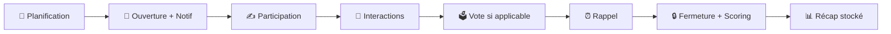
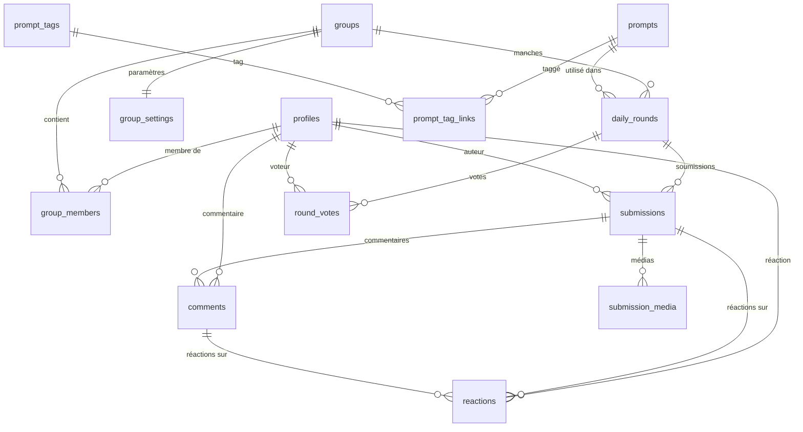
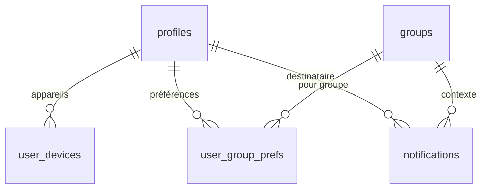
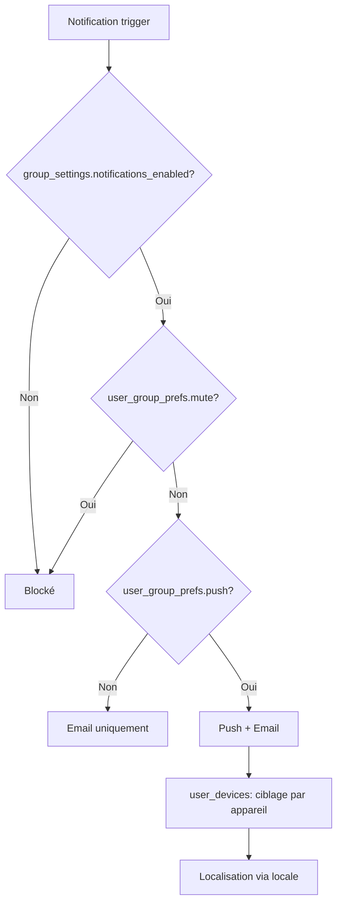
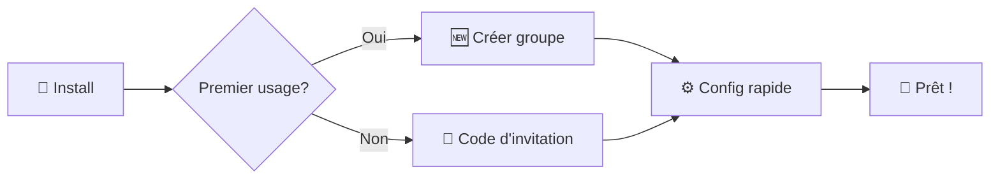
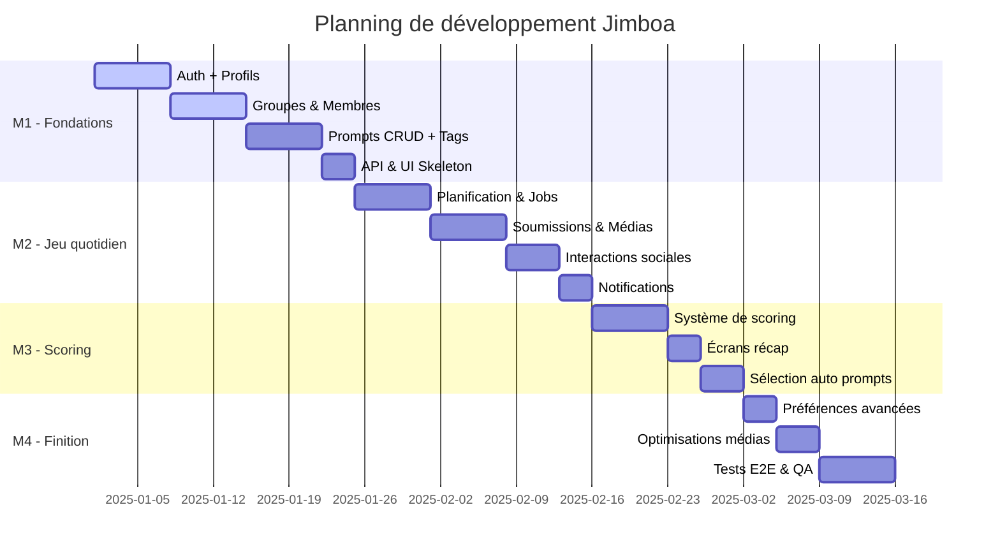

# 🎮 Jimboa

**Un jeu social quotidien pour groupes privés**

[](https://jimbao.fr)
[]()

> Jimboa propose un prompt quotidien (question, vote, challenge) à un groupe privé. Chaque membre peut publier immédiatement texte/média, commenter, réagir et voter. À la fermeture, la manche est scorée et un récap clair est enregistré pour le groupe.

---

## 📋 Table des matières

- [🎯 Vision & Concept](#-vision--concept)
- [👥 Proposition de valeur](#-proposition-de-valeur--personas)
- [🎲 Règles du jeu](#-règles-de-jeu--boucle-quotidienne)
- [✨ Fonctionnalités clés](#-fonctionnalités-clés-périmètre-v1)
- [🚫 Non-objectifs](#-non-objectifs--contraintes-actées)
- [🗄️ Modèle de données](#️-modèle-de-données-erd)
- [📊 Scoring & Schémas](#-scoring-par-manche--schémas-json)
- [🔔 Notifications](#-notifications--préférences)
- [📝 User Stories](#-user-stories-backlog)
- [⚙️ Workflow d'orchestration](#️-workflow-dorchestration-jobs)
- [🎨 Parcours UX](#-parcours-ux-prioritaires)
- [🗓️ Roadmap](#️-roadmap--jalons)
- [🧪 Qualité & Tests](#-qualité-dod--tests)
- [⚠️ Risques & Garde-fous](#️-risques--garde-fous)
- [📖 Glossaire](#-glossaire)

## 🎯 Vision & Concept

**Jimboa** transforme la routine quotidienne en moment de connexion sociale à travers des prompts engageants.

### 🌟 Positionnement

- **Léger** : Rituel simple de 5-10 minutes par jour
- **Intime** : Groupes privés (amis proches, couples)
- **Fun** : Prompts variés et interactions spontanées
- **Sans pression** : Pas de classement global ni de métriques intrusives

### 🎪 Concept central

Chaque jour, un prompt unique (question, vote, challenge) est proposé au groupe. Les membres participent librement avec du texte/média, commentent et réagissent en temps réel. À la fermeture, un récap clair immortalise cette manche quotidienne.

## 👥 Proposition de valeur & Personas

### 🎯 Personas cibles

#### 👫 Amis proches

- **Besoin** : Garder le lien au quotidien avec un rituel simple et amusant
- **Contexte** : Vies chargées, envie de maintenir la proximité sans contrainte

#### 💑 Couples

- **Besoin** : Entretenir complicité et conversation légère sans pression
- **Contexte** : Routine quotidienne, recherche de nouveaux sujets de discussion

### 🎪 Jobs-to-be-done

> _"Je veux un micro-rituel social quotidien qui ne demande pas d'organisation."_

> _"Je veux des sujets qui nous ressemblent, sans bruit ni algorithmes opaques."_

## 🎲 Règles de jeu & Boucle quotidienne

### ⏰ Cycle quotidien



### 📋 Règles fondamentales

1. **Planification** : Heure locale du groupe
2. **Ouverture** : Notification automatique à tous les membres
3. **Participation** : Soumissions visibles immédiatement (pas de mode "blind")
4. **Interactions** : Commentaires et réactions en temps réel
5. **Vote** : Si type="vote", 1 vote par personne maximum
6. **Rappel** : Notification avant fermeture (opt-in)
7. **Fermeture** : Scoring automatique → récap définitif

## ✨ Fonctionnalités clés (Périmètre v1)

### 👥 Gestion des groupes

- **Types** : `friends` ou `couple`
- **Rôles** : `owner` / `admin` / `member`
- **Invitations** : Code unique (activable/désactivable)

### 🎯 Système de prompts

- **Types** : Question, Vote, Challenge
- **Tagging** : Classification et filtrage
- **Sélection** : Automatique (IA) ou manuelle

### 💬 Interactions sociales

- **Soumissions** : Texte + médias (images, vidéos)
- **Commentaires** : Discussion libre
- **Réactions** : 👍 like, ❤️ love, 😂 haha, 😮 wow, 🔥 fire
- **Votes** : 1 vote par manche (type "vote" uniquement)

### 🔔 Notifications intelligentes

- **Ouverture** : Nouveau prompt disponible
- **Rappel** : Avant fermeture (personnalisable)
- **Préférences** : Par utilisateur et par groupe

### 🏆 Scoring local

- **Portée** : Par manche uniquement
- **Pas de leaderboard global** : Focus sur l'expérience quotidienne

## 🚫 Non-objectifs & Contraintes actées

### ❌ Fonctionnalités exclues

| Fonctionnalité                    | Raison                                                 |
| --------------------------------- | ------------------------------------------------------ |
| **Leaderboard global**            | Focus sur l'expérience quotidienne, pas la compétition |
| **Stats cumulées multi-manches**  | Éviter la gamification excessive                       |
| **Mode "blind"**                  | Interactions en temps réel privilégiées                |
| **Rôle "moderator"**              | Gouvernance simple : owner/admin suffisent             |
| **Système de signalement avancé** | Modération par owner/admin uniquement                  |

### 🎯 Contraintes de design

- **Transparence** : Soumissions visibles immédiatement
- **Simplicité** : Pas de mécaniques complexes
- **Intimité** : Groupes privés uniquement

## 🗄️ Modèle de données (ERD)

### 🔗 Relations principales



### 📱 Notifications & Préférences



### 📊 Dictionnaire des tables

#### 👤 Utilisateurs & Groupes

| Table              | Champs principaux                                                     | Contraintes               |
| ------------------ | --------------------------------------------------------------------- | ------------------------- |
| **profiles**       | `id` (=auth), `display_name`, `avatar_path`                           | Lié à auth.users          |
| **groups**         | `name`, `type` (friends\|couple), `owner_id`, `timezone`, `join_code` | `owner_id` → profiles     |
| **group_members**  | `group_id`, `user_id`, `role` (owner\|admin\|member)                  | UNIQUE(group_id, user_id) |
| **group_settings** | `group_id`, `drop_time`, `close_after_hours`, `notifications_enabled` | 1:1 avec groups           |

#### 🎯 Prompts & Manches

| Table            | Champs principaux                                                       | Contraintes                     |
| ---------------- | ----------------------------------------------------------------------- | ------------------------------- |
| **prompts**      | `type` (question\|vote\|challenge), `title`, `body`, `metadata` (jsonb) | Tags via prompt_tag_links       |
| **daily_rounds** | `group_id`, `prompt_id`, `scheduled_for`, `status`, `results` (jsonb)   | UNIQUE(group_id, scheduled_for) |
| **submissions**  | `round_id`, `author_id`, `content_text`, `score`                        | UNIQUE(round_id, author_id)     |

#### 💬 Interactions

| Table           | Champs principaux                                 | Contraintes                                       |
| --------------- | ------------------------------------------------- | ------------------------------------------------- |
| **comments**    | `submission_id`, `author_id`, `body`              | -                                                 |
| **reactions**   | `entity_type`, `entity_id`, `user_id`, `reaction` | UNIQUE(entity_type, entity_id, user_id, reaction) |
| **round_votes** | `round_id`, `voter_id`, `target_user_id`          | UNIQUE(round_id, voter_id), CHECK(voter≠target)   |

#### 🔔 Notifications

| Table                | Champs principaux                      | Contraintes                               |
| -------------------- | -------------------------------------- | ----------------------------------------- |
| **notifications**    | `user_id`, `type`, `payload`, `status` | Types: round_open, round_close_soon, etc. |
| **user_devices**     | `user_id`, `platform`, `token`         | Pour push notifications                   |
| **user_group_prefs** | `user_id`, `group_id`, `mute`, `push`  | UNIQUE(user_id, group_id)                 |

### ⚖️ Contraintes métier

#### 🎯 Règles de participation

| Contrainte                  | Description                  | Implémentation                                                    |
| --------------------------- | ---------------------------- | ----------------------------------------------------------------- |
| **1 round/jour/groupe**     | Unicité quotidienne          | `UNIQUE(group_id, scheduled_for)`                                 |
| **1 soumission/user/round** | Une participation par manche | `UNIQUE(round_id, author_id)`                                     |
| **1 vote/user/round**       | Vote unique, pas d'auto-vote | `UNIQUE(round_id, voter_id)` + `CHECK(voter_id ≠ target_user_id)` |
| **Visibilité immédiate**    | Pas de mode "blind"          | Soumissions visibles dès publication                              |

#### 🔐 Règles de sécurité

- **Appartenance stricte** : Toute action requiert membership du groupe
- **Owner invariant** : L'owner reste membre et non révoquable (si unique)
- **Fuseau horaire** : Planification locale, stockage UTC

## 📊 Scoring par manche & Schémas JSON

### 🎯 Principes du scoring

- **Par type de prompt** : Règles paramétrées dans `prompts.metadata`
- **Calcul à la fermeture** : Résultat écrit dans `daily_rounds.results`
- **Scope local** : Aucun cumul cross-manches

### ⚙️ Configuration (prompts.metadata)

```json
{
	"scoring": {
		"type": "question",
		"participation_points": 5,
		"reactions_weights": {
			"like": 1,
			"love": 2,
			"haha": 2,
			"wow": 2,
			"fire": 3
		},
		"reactions_caps": 10,
		"streak_bonus": {
			"enabled": false
		}
	}
}
```

### 📈 Résultat (daily_rounds.results)

```json
{
	"round_id": "uuid",
	"type": "question",
	"participants": ["u1", "u2", "u3"],
	"submissions": [
		{
			"author_id": "u1",
			"submission_id": "s1",
			"reactions": {
				"like": 3,
				"love": 1,
				"haha": 0,
				"wow": 1,
				"fire": 2
			},
			"score_breakdown": {
				"participation": 5,
				"reactions": 10
			},
			"total": 15
		}
	],
	"ranking": [
		{ "user_id": "u1", "total": 15 },
		{ "user_id": "u3", "total": 12 }
	],
	"ties": [],
	"computed_at": "2025-09-04T19:00:00Z",
	"rules_ref": {
		"prompt_id": "p123",
		"weights_version": "v1"
	}
}
```

## 🔔 Notifications & Préférences

### 📨 Types de notifications

| Type                 | Trigger                    | Timing                    |
| -------------------- | -------------------------- | ------------------------- |
| **round_open**       | Ouverture de manche        | À `open_at`               |
| **round_close_soon** | Rappel avant fermeture     | À `close_at - Δ` (ex: 1h) |
| **mention**          | Mention dans commentaire   | Temps réel                |
| **reaction**         | Réaction sur soumission    | Temps réel                |
| **comment**          | Commentaire sur soumission | Temps réel                |

### ⚙️ Système de préférences



## 📋 User Stories (Backlog)

### 🔐 Auth & Profil

- [ ] **Création profil** : Générer profil automatiquement à la première connexion
- [ ] **Édition profil** : Modifier `display_name` et avatar
- [ ] **Suppression compte** : Vérifier transfert ownership si owner unique

### 👥 Groupes

- [ ] **Création groupe** : Choisir type (friends|couple) et fuseau horaire
- [ ] **Rejoindre groupe** : Via code d'invitation (si `join_enabled=true`)
- [ ] **Gestion codes** : Régénérer/désactiver code d'invitation
- [ ] **Gestion rôles** : Promouvoir/rétrograder admin
- [ ] **Quitter groupe** : Bloqué si owner unique

### ⚙️ Réglages

- [ ] **Horaires groupe** : Définir `drop_time` & `close_after_hours`
- [ ] **Notifications groupe** : Activer/désactiver `notifications_enabled`
- [ ] **Préférences personnelles** : Mute/push par groupe

### 🎯 Prompts

- [ ] **CRUD prompts** : Créer/modifier (type, titre, corps, média, tags)
- [ ] **Gestion statut** : Activer/désactiver prompts
- [ ] **Sélection intelligente** : Auto (diversité, fraîcheur, tags) ou manuelle

### 🎲 Manches quotidiennes

- [ ] **Planification auto** : Créer manche J+1 si absente
- [ ] **Ouverture auto** : Déclencher à `open_at`
- [ ] **Rappels** : Notifier avant fermeture
- [ ] **Fermeture & scoring** : Calculer et stocker résultats

### 📝 Participation

- [ ] **Soumissions** : 1 par user/round (texte + médias)
- [ ] **Interactions** : Commenter et réagir (👍❤️😂😮🔥)
- [ ] **Votes** : 1 vote par round (type "vote"), modifiable avant fermeture

### 🔔 Notifications

- [ ] **Système core** : `round_open` / `round_close_soon`
- [ ] **Sociales** : Mentions, réactions, commentaires (optionnelles)

### ✅ Critères d'acceptation (Gherkin)

#### Soumission unique

```gherkin
Étant donné un round ouvert
Quand je publie une deuxième soumission
Alors l'action échoue avec "Une seule soumission par manche"
```

#### Vote unique & anti-auto-vote

```gherkin
Étant donné un round de type "vote"
Quand je vote pour moi-même
Alors l'action est rejetée (auto-vote interdit)
```

#### Ouverture & rappel automatiques

```gherkin
Étant donné un round planifié pour aujourd'hui
Quand open_at est atteint
Alors le statut passe à "open" ET une notification est émise

Et quand close_at - 1h est atteint ET je n'ai pas participé
Alors je reçois une notification "round_close_soon"
```

## ⚙️ Workflow d'orchestration (Jobs)

### 🔄 Jobs automatisés

```mermaid
gantt
    title Cycle quotidien des jobs
    dateFormat HH:mm
    axisFormat %H:%M

    section Planification
    Création manches J+1    :active, plan, 00:00, 00:30

    section Exécution
    Ouverture manches        :active, open, 06:00, 23:00
    Rappels                  :active, remind, 06:00, 23:00
    Fermeture & scoring      :active, close, 06:00, 23:59
```



#### 📅 Planification (quotidien, 00:00)

```sql
-- Pour chaque groupe actif sans round J+1
INSERT INTO daily_rounds (group_id, prompt_id, scheduled_for, status)
SELECT g.id, selected_prompt_id, CURRENT_DATE + 1, 'scheduled'
FROM groups g
WHERE g.is_active = true
  AND NOT EXISTS (
    SELECT 1 FROM daily_rounds dr
    WHERE dr.group_id = g.id
    AND dr.scheduled_for = CURRENT_DATE + 1
  )
```

#### 🔓 Ouverture (toutes les 5 min)

```sql
UPDATE daily_rounds
SET status = 'open', open_at = NOW()
WHERE status = 'scheduled'
  AND scheduled_for <= CURRENT_DATE
  AND EXTRACT(hour FROM NOW()) >= EXTRACT(hour FROM drop_time)
```

#### ⏰ Rappels (toutes les 10 min)

```sql
-- Notifier les non-participants avant fermeture
INSERT INTO notifications (user_id, group_id, type, payload)
SELECT gm.user_id, dr.group_id, 'round_close_soon', '{}'
FROM daily_rounds dr
JOIN group_members gm ON dr.group_id = gm.group_id
WHERE dr.status = 'open'
  AND dr.close_at - NOW() <= INTERVAL '1 hour'
  AND NOT EXISTS (SELECT 1 FROM submissions s WHERE s.round_id = dr.id AND s.author_id = gm.user_id)
```

#### 🔒 Fermeture & Scoring (toutes les 5 min)

```sql
-- Transition: open → closed → scored
UPDATE daily_rounds
SET status = 'closed', close_at = NOW()
WHERE status = 'open' AND close_at <= NOW();

-- Calcul scoring + results JSONB
-- Puis: status = 'scored'
```

### 🔒 Garanties d'intégrité

- **Idempotence** : Clés uniques + transitions strictes
- **Concurrence** : Advisory locks par `group_id` si nécessaire
- **Monitoring** : Logs des transitions de statut

## 🎨 Parcours UX prioritaires

### 🚀 Onboarding (< 2 min)



### 🏠 Écran principal "Aujourd'hui"

```
┌────────────────────────────────────────┐
│  🎯 PROMPT DU JOUR                    │
│  "Quel est votre super-pouvoir rêvé?"   │
│                                        │
│  [ ✍️ Répondre ]     ⏰ Ferme à 20h00     │
├────────────────────────────────────────┤
│  📝 SOUMISSIONS (temps réel)           │
│                                        │
│  👤 Alice: "Lire dans les pensées!"    │
│  👍 3  ❤️ 1  😂 2  🔥 1           │
│  💬 2 commentaires                    │
│                                        │
│  👤 Bob: "Voler comme Superman"       │
│  👍 5  ❤️ 2  😮 1              │
│  💬 1 commentaire                     │
└────────────────────────────────────────┘
```

### 📈 Round terminé (Récap)

```
┌────────────────────────────────────────┐
│  🏆 RÉSULTATS - HIER                   │
│                                        │
│  1️⃣ Bob      18 pts  (👍5 ❤️2 😮1)       │
│  2️⃣ Alice    15 pts  (👍3 ❤️1 😂2 🔥1)  │
│  3️⃣ Charlie 12 pts  (👍4 ❤️1)         │
│                                        │
│  📊 3 participants, 8 réactions        │
│  📸 2 médias partagés                 │
│                                        │
│  [ 🔗 Voir détails ]                   │
└────────────────────────────────────────┘
```

### ⚙️ Écrans secondaires

- **Réglages groupe** : Heure locale, durée, notifications, type
- **Banque prompts** : Filtre par tags, "Choisir pour demain"
- **Historique** : Manches passées avec récaps

## 🗺️ Roadmap & Jalons



### 🏁 Milestone M1 — Fondations (3 semaines)

- ✅ **Auth + Profils** : Supabase Auth, création profils automatique
- ✅ **Groupes & Membres** : CRUD groupes, rôles, codes d'invitation
- 🔄 **Prompts CRUD** : Interface admin, système de tags
- 🔄 **Infrastructure** : ERD, API REST, écrans skeleton

### 🎲 Milestone M2 — Jeu quotidien (3 semaines)

- ⏳ **Jobs d'orchestration** : Planification, ouverture, fermeture
- ⏳ **Participation** : Soumissions texte/média, upload sécurisé
- ⏳ **Interactions** : Commentaires, réactions, votes uniques
- ⏳ **Notifications** : Push ouverture + rappels

### 📈 Milestone M3 — Scoring & Récap (2 semaines)

- ⏳ **Engine scoring** : Métadata prompts, calcul dynamique
- ⏳ **Interface récap** : Classements, stats visuelles
- ⏳ **IA prompts** : Sélection diversifiée et intelligente

### 🎨 Milestone M4 — Finition & QA (2 semaines)

- ⏳ **UX avancée** : Préférences granulaires, mute/push
- ⏳ **Médias** : Previews, compression, limites
- ⏳ **Robustesse** : Hardening jobs, gestion concurrence
- ⏳ **Qualité** : Tests E2E complets, monitoring

## 🧪 Qualité, DoD & Tests

### ✅ Definition of Done (DoD)

| Critère           | Description                           | Vérification        |
| ----------------- | ------------------------------------- | ------------------- |
| **Règles métier** | Codées & testées (unit + integration) | ✅ Tests passent    |
| **UX/UI**         | Erreurs explicites & localisées (FR)  | ✅ Messages clairs  |
| **Observabilité** | Logs des transitions de round         | ✅ Traces complètes |
| **E2E**           | Parcours critiques testés             | ✅ Scénarios OK     |

### 🧪 Plan de tests

#### 🔬 Tests unitaires

- **Contraintes unicité** : Soumission/vote/round par jour
- **Logique métier** : Scoring, transitions statuts
- **Validations** : Schémas, formats, limites

#### 🌐 Tests d'intégration

- **Fuseaux horaires** : Groupes dans plusieurs TZ
- **Notifications** : Respect préférences & mute
- **Uploads** : Formats/tailles, sécurité
- **Concurrence** : Double ouverture/fermeture

#### 🎨 Tests E2E (Playwright)

```gherkin
Scénario: Cycle complet de participation
  Étant donné un groupe actif avec 3 membres
  Quand une manche s'ouvre automatiquement
  Et que chaque membre soumet une réponse
  Et que des interactions ont lieu (commentaires, réactions)
  Et que la manche se ferme automatiquement
  Alors le scoring est calculé et stocké
  Et un récap est disponible pour tous
```

## ⚠️ Risques & Garde-fous

### 🔒 Risques techniques

| Risque                 | Impact                | Mitigation                            |
| ---------------------- | --------------------- | ------------------------------------- |
| **Concurrence jobs**   | 🔴 Corruption données | Advisory locks + transitions strictes |
| **Spam notifications** | 🟡 UX dégradée        | Préférences + `notifications_enabled` |
| **Surcharge uploads**  | 🟡 Performance        | Limites taille + compression          |
| **Race conditions**    | 🔴 États incohérents  | Transactions + contraintes DB         |

### 🛡️ Risques produit

| Risque                   | Impact                   | Mitigation                                |
| ------------------------ | ------------------------ | ----------------------------------------- |
| **Contenus sensibles**   | 🟡 Modération nécessaire | Suppression owner/admin (v1)              |
| **Fatigue prompts**      | 🟡 Engagement baisse     | Sélection diversifiée + banque croissante |
| **Groupes inactifs**     | 🟢 Ressources gaspillées | Détection + archivage auto                |
| **Abandon utilisateurs** | 🟡 Rétention faible      | Onboarding optimisé + notifications       |

### 📊 Monitoring & Alertes

- **Métriques core** : Participation quotidienne, temps de réponse jobs
- **Alertes** : Échecs jobs, pics d'erreurs, goulets d'étranglement
- **Dashboards** : Santé système, usage utilisateurs, performance

## 📚 Glossaire

### 🎯 Termes métier

| Terme          | Définition                                       | Exemple                                         |
| -------------- | ------------------------------------------------ | ----------------------------------------------- |
| **Prompt**     | Consigne quotidienne (question, vote, challenge) | "Quel est votre plat préféré ?"                 |
| **Round**      | Manche quotidienne d'un groupe                   | Round du 04/01/2025 pour "Les Copains"          |
| **Soumission** | Réponse d'un membre au prompt                    | Texte + image en réponse                        |
| **Scoring**    | Calcul des points de la manche uniquement        | Participation (5pts) + Réactions (8pts) = 13pts |

### 👥 Rôles & Permissions

| Rôle       | Permissions                        | Contraintes                                 |
| ---------- | ---------------------------------- | ------------------------------------------- |
| **Owner**  | Tout + transfert ownership         | Toujours membre, non révoquable (si unique) |
| **Admin**  | Gestion groupe + prompts + membres | Nommé par owner                             |
| **Member** | Participation + interactions       | Rôle par défaut                             |

### 📱 Interactions

| Type             | Description                                  | Symboles                      |
| ---------------- | -------------------------------------------- | ----------------------------- |
| **Réactions**    | Feedback rapide sur soumissions/commentaires | 👍 ❤️ 😂 😮 🔥                |
| **Commentaires** | Discussion libre                             | Texte libre                   |
| **Votes**        | Choix dans les prompts "vote"                | 1 vote/round, pas d'auto-vote |
