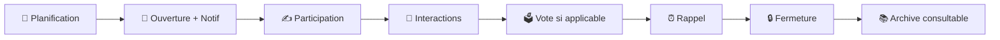
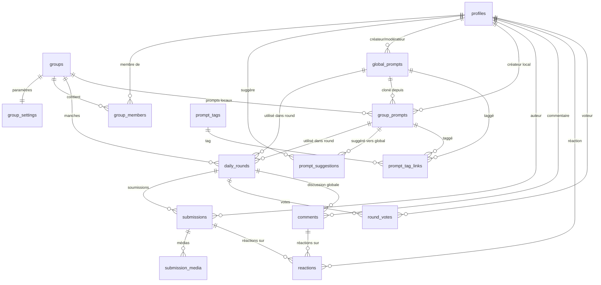
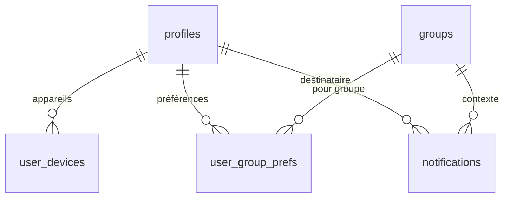
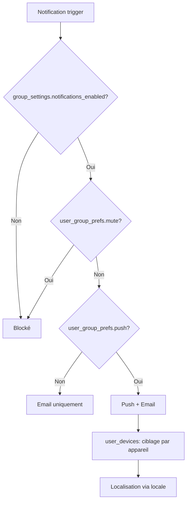
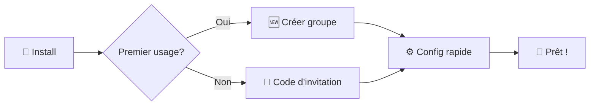

# 🎮 Jimbao

**Un jeu social quotidien pour groupes privés**

[](https://jimbao.fr)
[]()

> Jimboa propose un prompt quotidien (question, vote, challenge) à un groupe privé. Chaque membre peut publier immédiatement texte/média, commenter, réagir et voter. À la fermeture, la manche est archivée et reste consultable par le groupe.

---

## 📋 Table des matières

- [🎯 Vision & Concept](#-vision--concept)
- [👥 Proposition de valeur](#-proposition-de-valeur--personas)
- [🎲 Règles du jeu](#-règles-de-jeu--boucle-quotidienne)
- [✨ Fonctionnalités clés](#-fonctionnalités-clés-périmètre-v1)
- [🗄️ Modèle de données](#️-modèle-de-données-erd)
- [🔔 Notifications](#-notifications--préférences)
- [📝 User Stories](#-user-stories-backlog)
- [⚙️ Workflow d'orchestration](#️-workflow-dorchestration-jobs)
- [🎨 Parcours UX](#-parcours-ux-prioritaires)
- [🗓️ Roadmap](#️-roadmap--jalons)
- [⚠️ Risques & Garde-fous](#️-risques--garde-fous)
- [📖 Glossaire](#-glossaire)

## 🎯 Vision & Concept

**Jimboa** transforme la routine quotidienne en moment de connexion sociale à travers des prompts engageants.

### 🌟 Positionnement

- **Léger** : Rituel simple de 5-10 minutes par jour
- **Intime** : Groupes privés (amis proches, couples)
- **Fun** : Prompts variés et interactions spontanées
- **Sans pression** : Pas de classement global ni de métriques intrusives

### 🎪 Concept central

Chaque jour, un prompt unique (question, vote, challenge) est proposé au groupe. Les membres participent librement avec du texte/média, commentent et réagissent en temps réel. À la fermeture, la manche est archivée et reste consultable avec tout son contenu.

## 👥 Proposition de valeur & Personas

### 🎯 Personas cibles

#### 👫 Amis proches

- **Besoin** : Garder le lien au quotidien avec un rituel simple et amusant
- **Contexte** : Vies chargées, envie de maintenir la proximité sans contrainte

#### 💑 Couples

- **Besoin** : Entretenir complicité et conversation légère sans pression
- **Contexte** : Routine quotidienne, recherche de nouveaux sujets de discussion

### 🎪 Jobs-to-be-done

> _"Je veux un micro-rituel social quotidien qui ne demande pas d'organisation."_

> _"Je veux des sujets qui nous ressemblent, sans bruit ni algorithmes opaques."_

## 🎲 Règles de jeu & Boucle quotidienne

### ⏰ Cycle quotidien



### 📋 Règles fondamentales

1. **Planification** : Heure locale du groupe
2. **Ouverture** : Notification automatique à tous les membres
3. **Participation** : Soumissions visibles immédiatement (pas de mode "blind")
4. **Interactions** : Commentaires et votes visibles après avoir soumis sa réponse
5. **Vote** : Si type="vote", 1 vote par personne maximum
6. **Rappel** : Notification avant fermeture (opt-in)
7. **Fermeture** : Archivage automatique → consultation en lecture seule

## ✨ Fonctionnalités clés (Périmètre v1)

### 👥 Gestion des groupes

- **Types** : `friends` ou `couple`
- **Rôles** : `owner` unique / `admin` / `member`
- **Invitations** : Code permanent modifiable, généré automatiquement
- **Image de profil** : Avatar personnalisable pour chaque groupe
- **Authentification** : Google OAuth uniquement
- **Configuration** : Email du créateur défini via `APP_CREATOR_EMAIL` dans .env

### 🎯 Système de prompts hybride

- **Banque globale curatée** : Starter pack de prompts approuvés pour tous les groupes
- **Prompts locaux** : Owners/admins peuvent créer des prompts spécifiques à leur groupe
- **Système de suggestions** : Proposer des prompts locaux réussis vers la banque globale
- **Contributions communautaires** : Suggérer des prompts locaux réussis pour la banque globale
- **Types** : Question, Vote, Challenge (global et local)
- **Workflow global** : Pending → Approved/Rejected → Archived
- **Workflow local** : Création directe par owner/admin, édition libre
- **Tagging & filtrage** : Classification par tags, langue, difficulté
- **Sélection** : Automatique (globaux + locaux) ou manuelle par groupe

### 💬 Interactions sociales

- **Soumissions** : Texte + médias, 1 par user/manche, visibles uniquement après avoir soumis, pas d'édition
- **Suppression** : Possible pendant la fenêtre ouverte (libère le quota pour re-soumission)
- **Commentaires** : Discussion globale sous chaque question du jour (visible après avoir soumis)
- **Votes** : 1 vote par manche (type "vote" uniquement)
- **Visibilité conditionnelle** : Soumissions, discussion et votes visibles uniquement après avoir soumis sa réponse

### 🔔 Notifications intelligentes

- **Ouverture** : Nouveau prompt disponible
- **Rappel** : Avant fermeture (personnalisable)
- **Préférences** : Par utilisateur et par groupe

### 📚 Consultation des manches

- **Archives** : Toutes les manches fermées restent consultables
- **Pas de scoring** : Focus sur le partage et l'interaction
- **Lecture seule** : Aucune interaction possible sur les manches fermées

### 🛡️ Gestion des prompts

#### 🌍 Prompts globaux (curatés)

- **Accès exclusif** : Seul le créateur de l'app peut parcourir et gérer la banque globale
- **Starter pack** : Collection initiale de prompts approuvés par le créateur
- **Contributions** : Suggestions issues des meilleurs prompts locaux (via suggestions)
- **Modération centralisée** : App creator valide les ajouts à la banque globale
- **Interface d'admin** : Dashboard exclusif au créateur pour gérer la banque globale
- **Qualité éditoriale** : Cohérence, universalité, respect des valeurs

#### 🏠 Prompts locaux (liberté créative)

- **Accès restreint** : Seuls les owners/admins peuvent parcourir et gérer la banque locale de leur groupe
- **Création libre** : Owners/admins créent directement pour leur groupe
- **Pas de clonage direct** : Les prompts globaux ne sont plus directement clonables (accès restreint)
- **Événements privés** : Prompts spécifiques (anniversaires, blagues internes)
- **Langues locales** : Adaptation linguistique et culturelle
- **Pas de modération** : Liberté totale dans le cadre du groupe

## 🗄️ Modèle de données (ERD)

### 🔗 Relations principales



### 📱 Notifications & Préférences



### 📊 Dictionnaire des tables

#### 👤 Utilisateurs & Groupes

| Table              | Champs principaux                                                                                   | Contraintes                         |
| ------------------ | --------------------------------------------------------------------------------------------------- | ----------------------------------- |
| **profiles**       | `id` (=auth), `display_name`, `image_path`                                                          | Lié à auth.users (Google)           |
| **groups**         | `name`, `type` (friends\|couple), `owner_id`, `timezone`, `join_enabled`, `join_code`, `image_path` | `owner_id` → profiles, owner unique |
| **group_members**  | `group_id`, `user_id`, `role` (owner\|admin\|member)                                                | UNIQUE(group_id, user_id)           |
| **group_settings** | `group_id`, `drop_time`, `close_after_hours`, `notifications_enabled`                               | 1:1 avec groups                     |

#### 🎯 Prompts & Manches

| Table                  | Champs principaux                                                                                                                                                                 | Contraintes                                                            |
| ---------------------- | --------------------------------------------------------------------------------------------------------------------------------------------------------------------------------- | ---------------------------------------------------------------------- |
| **global_prompts**     | `type` (question\|vote\|challenge), `title`, `body`, `status` (pending\|approved\|rejected\|archived), `created_by`, `reviewed_by`, `reviewed_at`, `feedback`, `metadata` (jsonb) | Banque globale curatée, seuls les 'approved' sont visibles aux groupes |
| **group_prompts**      | `group_id`, `type`, `title`, `body`, `is_active`, `cloned_from_global`, `created_by`, `metadata` (jsonb)                                                                          | Prompts locaux créés/clonés par owners/admins                          |
| **prompt_suggestions** | `group_prompt_id`, `suggested_by`, `status` (pending\|approved\|rejected), `feedback`                                                                                             | Suggestions de prompts locaux → globaux                                |
| **daily_rounds**       | `group_id`, `global_prompt_id`, `group_prompt_id`, `scheduled_for`, `status` (scheduled\|open\|closed)                                                                            | UNIQUE(group_id, scheduled_for), utilise soit global soit group prompt |
| **submissions**        | `round_id`, `author_id`, `content_text`                                                                                                                                           | UNIQUE(round_id, author_id)                                            |

#### 💬 Interactions

| Table           | Champs principaux                        | Contraintes                                     |
| --------------- | ---------------------------------------- | ----------------------------------------------- |
| **comments**    | `round_id`, `author_id`, `body`          | Discussion globale sur la question du jour      |
| **round_votes** | `round_id`, `voter_id`, `target_user_id` | UNIQUE(round_id, voter_id), CHECK(voter≠target) |

#### 🔔 Notifications

| Table                | Champs principaux                      | Contraintes                               |
| -------------------- | -------------------------------------- | ----------------------------------------- |
| **notifications**    | `user_id`, `type`, `payload`, `status` | Types: round_open, round_close_soon, etc. |
| **user_devices**     | `user_id`, `platform`, `token`         | Pour push notifications                   |
| **user_group_prefs** | `user_id`, `group_id`, `mute`, `push`  | UNIQUE(user_id, group_id)                 |

### ⚖️ Contraintes métier

#### 🎯 Règles de participation

| Contrainte                        | Description                                  | Implémentation                                                    |
| --------------------------------- | -------------------------------------------- | ----------------------------------------------------------------- |
| **1 round/jour/groupe**           | Unicité quotidienne                          | `UNIQUE(group_id, scheduled_for)`                                 |
| **1 soumission/user/round**       | Une participation par manche, pas d'édition  | `UNIQUE(round_id, author_id)`                                     |
| **Suppression = nouvelle chance** | Supprimer libère le quota pour re-soumission | Suppression possible uniquement pendant round ouvert              |
| **1 vote/user/round**             | Vote unique, pas d'auto-vote                 | `UNIQUE(round_id, voter_id)` + `CHECK(voter_id ≠ target_user_id)` |
| **Visibilité immédiate**          | Pas de mode "blind"                          | Soumissions visibles dès publication                              |
| **Visibilité conditionnelle**     | Interactions après soumission                | Commentaires/votes visibles après avoir soumis sa réponse         |

#### 🔐 Règles de sécurité

- **Appartenance stricte** : Toute action requiert membership du groupe
- **Owner unique** : Exactement 1 owner par groupe, non révoquable sans transfert
- **Fuseau horaire** : Planification locale, stockage UTC
- **Modération centralisée** : Seul le créateur de l'app (APP_CREATOR_EMAIL) peut valider les prompts
- **Prompts approuvés uniquement** : Les groupes ne peuvent sélectionner que des prompts avec status='approved'

#### 🔑 Sécurité des codes d'invitation

- **Génération automatique** : Code créé à la création du groupe (6 caractères alphanumériques)
- **Permanence** : Code permanent, pas d'expiration ni de quota d'utilisation
- **Modification** : Possibilité de régénérer un nouveau code (invalide l'ancien)
- **Stockage sécurisé** : Hash du code stocké dans `groups.join_code` (SHA-256 + salt)
- **Rate limiting** : Maximum 5 tentatives de join par IP/heure
- **Activation** : Code utilisable uniquement si `join_enabled=true`

## 🔔 Notifications & Préférences

### 📨 Types de notifications

| Type                 | Trigger                | Timing                    |
| -------------------- | ---------------------- | ------------------------- |
| **round_open**       | Ouverture de manche    | À `open_at`               |
| **round_close_soon** | Rappel avant fermeture | À `close_at - Δ` (ex: 1h) |

### ⚙️ Système de préférences



## 📋 User Stories

Pour consulter toutes les user stories détaillées organisées par épiques, voir : **[user-stories.md](./user-stories.md)**

Le document contient 19 épiques couvrant :

- Authentification & Profil (Google OAuth)
- Gestion des groupes et rôles
- Système de prompts et manches quotidiennes
- Interactions sociales (commentaires, votes)
- Notifications et préférences
- Sécurité et intégrité des données

### ✅ Critères d'acceptation (Gherkin)

#### Soumission unique

```gherkin
Étant donné un round ouvert
Quand je publie une deuxième soumission
Alors l'action échoue avec "Une seule soumission par manche"
```

#### Vote unique & anti-auto-vote

```gherkin
Étant donné un round de type "vote"
Quand je vote pour moi-même
Alors l'action est rejetée (auto-vote interdit)
```

#### Ouverture & rappel automatiques

```gherkin
Étant donné un round planifié pour aujourd'hui
Quand open_at est atteint
Alors le statut passe à "open" ET une notification est émise

Et quand close_at - 1h est atteint ET je n'ai pas participé
Alors je reçois une notification "round_close_soon"
```

## ⚙️ Workflow d'orchestration (Jobs)

### 🔄 Jobs automatisés


#### 📅 Planification (quotidien, 00:00)

```sql
-- Pour chaque groupe actif sans round J+1
INSERT INTO daily_rounds (group_id, prompt_id, scheduled_for, status)
SELECT g.id, selected_prompt_id, CURRENT_DATE + 1, 'scheduled'
FROM groups g
WHERE g.is_active = true
  AND NOT EXISTS (
    SELECT 1 FROM daily_rounds dr
    WHERE dr.group_id = g.id
    AND dr.scheduled_for = CURRENT_DATE + 1
  )
```

#### 🔓 Ouverture (toutes les 5 min)

```sql
UPDATE daily_rounds
SET status = 'open', open_at = NOW()
WHERE status = 'scheduled'
  AND scheduled_for <= CURRENT_DATE
  AND EXTRACT(hour FROM NOW()) >= EXTRACT(hour FROM drop_time)
```

#### ⏰ Rappels (toutes les 10 min)

```sql
-- Notifier les non-participants avant fermeture
INSERT INTO notifications (user_id, group_id, type, payload)
SELECT gm.user_id, dr.group_id, 'round_close_soon', '{}'
FROM daily_rounds dr
JOIN group_members gm ON dr.group_id = gm.group_id
WHERE dr.status = 'open'
  AND dr.close_at - NOW() <= INTERVAL '1 hour'
  AND NOT EXISTS (SELECT 1 FROM submissions s WHERE s.round_id = dr.id AND s.author_id = gm.user_id)
```

#### 🔒 Fermeture & Archivage (toutes les 5 min)

```sql
-- Transition: open → closed (état final)
UPDATE daily_rounds
SET status = 'closed', close_at = NOW()
WHERE status = 'open' AND close_at <= NOW();

-- Les soumissions, commentaires et votes sont figés
-- La manche reste consultable indéfiniment
```

### 🔒 Garanties d'intégrité

- **Idempotence** : Clés uniques + transitions strictes
- **Concurrence** : Advisory locks par `group_id` si nécessaire
- **Monitoring** : Logs des transitions de statut

## 🎨 Parcours UX prioritaires

### 🚀 Onboarding (< 2 min)



### 🏠 Écran principal "Aujourd'hui"

#### **Avant de soumettre sa réponse :**

```
┌────────────────────────────────────────┐
│  🎯 PROMPT DU JOUR                    │
│  "Quel est votre super-pouvoir rêvé?"   │
│                                        │
│  [ ✍️ Répondre ]     ⏰ Ferme à 20h00     │
├────────────────────────────────────────┤
│  🔒 Contenu masqué                     │
│                                        │
│  Soumettez votre réponse pour voir :   │
│  • Les réponses des autres membres     │
│  • La discussion du groupe             │
│  • Les votes (si applicable)           │
│                                        │
│  👥 3 membres ont déjà participé        │
└────────────────────────────────────────┘
```

#### **Après avoir soumis sa réponse :**

```
┌────────────────────────────────────────┐
│  🎯 PROMPT DU JOUR                    │
│  "Quel est votre super-pouvoir rêvé?"   │
│                                        │
│  ✅ Votre réponse: "Téléportation!"     │
├────────────────────────────────────────┤
│  📝 SOUMISSIONS (temps réel)           │
│                                        │
│  👤 Alice: "Lire dans les pensées!"    │
│  👤 Bob: "Voler comme Superman"       │
│  👤 Vous: "Téléportation!"            │
├────────────────────────────────────────┤
│  🗳️ VOTES (si applicable)              │
│  👤 Alice: 2 votes                    │
│  👤 Bob: 1 vote                       │
├────────────────────────────────────────┤
│  💬 DISCUSSION GLOBALE                 │
│                                        │
│  👤 Alice: "Excellent choix Bob!"      │
│  👤 Charlie: "Moi j'hésite encore..."  │
│  [ 💬 Ajouter un commentaire ]         │
└────────────────────────────────────────┘
```

### 📚 Round archivé (Consultation)

```
┌────────────────────────────────────────┐
│  📚 MANCHE D'HIER - Fermée             │
│                                        │
│  👤 Bob: "Voler comme Superman"       │
│  💬 3 commentaires                    │
│                                        │
│  👤 Alice: "Lire dans les pensées!"    │
│  💬 2 commentaires                    │
│                                        │
│  👤 Charlie: "Téléportation!"         │
│  💬 1 commentaire                     │
│                                        │
│  📊 3 participants, 6 commentaires     │
│  📸 2 médias partagés                 │
│  🔒 Fermée - Lecture seule             │
└────────────────────────────────────────┘
```

### ⚙️ Écrans secondaires

- **Réglages groupe** : Heure locale, durée, notifications, type
- **Banque prompts** : Filtre par tags, "Choisir pour demain"
- **Historique** : Manches passées consultables avec tout leur contenu

## ⚠️ Risques & Garde-fous

### 🔒 Risques techniques

| Risque                 | Impact                | Mitigation                            |
| ---------------------- | --------------------- | ------------------------------------- |
| **Concurrence jobs**   | 🔴 Corruption données | Advisory locks + transitions strictes |
| **Spam notifications** | 🟡 UX dégradée        | Préférences + `notifications_enabled` |
| **Surcharge uploads**  | 🟡 Performance        | Limites taille + compression          |
| **Race conditions**    | 🔴 États incohérents  | Transactions + contraintes DB         |

### 🛡️ Risques produit

| Risque                   | Impact                   | Mitigation                                |
| ------------------------ | ------------------------ | ----------------------------------------- |
| **Contenus sensibles**   | 🟡 Modération nécessaire | Suppression owner/admin (v1)              |
| **Fatigue prompts**      | 🟡 Engagement baisse     | Sélection diversifiée + banque croissante |
| **Groupes inactifs**     | 🟢 Ressources gaspillées | Détection + archivage auto                |
| **Abandon utilisateurs** | 🟡 Rétention faible      | Onboarding optimisé + notifications       |

### 📊 Monitoring & Alertes

- **Métriques core** : Participation quotidienne, temps de réponse jobs
- **Alertes** : Échecs jobs, pics d'erreurs, goulets d'étranglement
- **Dashboards** : Santé système, usage utilisateurs, performance

## 📚 Glossaire

### 🎯 Termes métier

| Terme          | Définition                                       | Exemple                                   |
| -------------- | ------------------------------------------------ | ----------------------------------------- |
| **Prompt**     | Consigne quotidienne (question, vote, challenge) | "Quel est votre plat préféré ?"           |
| **Round**      | Manche quotidienne d'un groupe                   | Round du 04/01/2025 pour "Les Copains"    |
| **Soumission** | Réponse d'un membre au prompt                    | Texte + image en réponse                  |
| **Archivage**  | Consultation des manches fermées                 | Toutes les contributions restent visibles |

### 👥 Rôles & Permissions

| Rôle            | Permissions                                                                        | Contraintes                                         |
| --------------- | ---------------------------------------------------------------------------------- | --------------------------------------------------- |
| **App Creator** | Modération banque globale + administration système + accès exclusif banque globale | Email défini dans .env, seul accès interface admin  |
| **Owner**       | Gestion groupe + gestion prompts locaux + suggestions (PAS d'accès banque globale) | Unique par groupe, non révoquable sans transfert    |
| **Admin**       | Gestion prompts locaux + sélection + membres (PAS d'accès banque globale)          | Nommé par owner                                     |
| **Member**      | Participation + interactions + suggestion prompts locaux vers globaux              | Rôle par défaut, aucun accès aux banques de prompts |

### 📱 Interactions

| Type             | Description                   | Symboles                      |
| ---------------- | ----------------------------- | ----------------------------- |
| **Commentaires** | Discussion libre              | Texte libre                   |
| **Votes**        | Choix dans les prompts "vote" | 1 vote/round, pas d'auto-vote |

## 🗓️ Roadmap Approche Hybride

### 🚀 Phase 1 - Fondations hybrides

- [x] Séparer prompts globaux et locaux dans le modèle de données
- [ ] Interface de découverte des prompts globaux (liste + tags + filtres)
- [ ] Fonctionnalité de clonage vers prompts locaux
- [ ] Création directe de prompts locaux par owners/admins
- [ ] Starter pack de prompts globaux approuvés

### 🎯 Phase 2 - Expérience utilisateur

- [ ] Filtrage avancé (tags, langue, difficulté, type de groupe)
- [ ] Édition locale des prompts clonés
- [ ] Interface de gestion des prompts locaux
- [ ] Sélection intelligente (mix global/local)
- [ ] Preview des prompts avant sélection

### 🌟 Phase 3 - Contributions communautaires

- [ ] Système de suggestions (prompt local → global)
- [ ] Interface de modération pour l'app creator
- [ ] Analytics sur les prompts populaires
- [ ] Workflow d'approbation avec feedback
- [ ] Historique des contributions

### 🔮 Phase 4 - Intelligence & Personnalisation

- [ ] Recommandations basées sur l'historique du groupe
- [ ] Détection automatique des prompts locaux réussis
- [ ] Suggestions proactives de conversion vers global
- [ ] Analytics avancés pour l'app creator
- [ ] API pour contributions externes
