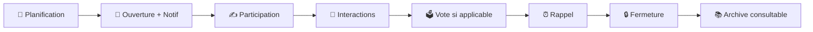
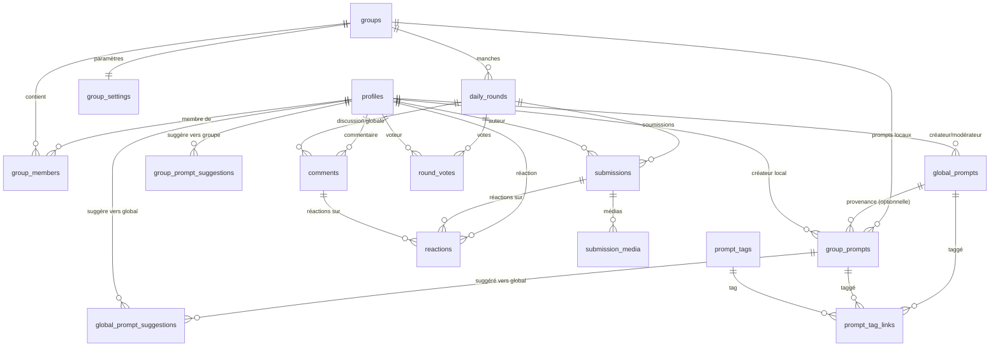
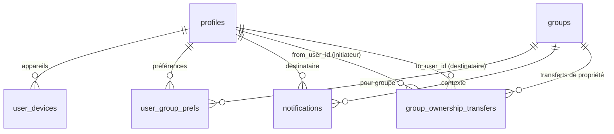
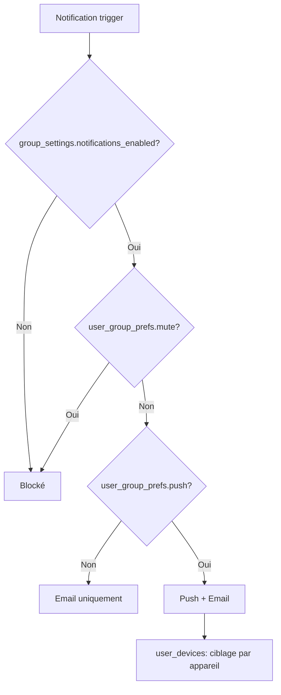
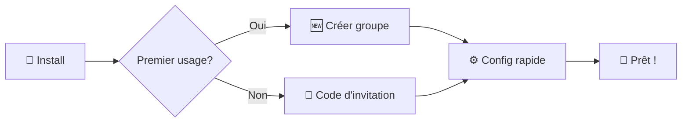

# 🎮 Jimboa

**Un jeu social quotidien pour groupes privés**

[](https://jimboa.fr)
[]()

> Jimboa propose un prompt quotidien (question, vote, challenge) à un groupe privé. Chaque membre peut publier texte/média, commenter, réagir et voter. À la fermeture, la manche est archivée et reste consultable par le groupe.

---

## 📋 Table des matières

- [🎯 Vision & Concept](#-vision--concept)
- [👥 Proposition de valeur](#-proposition-de-valeur--personas)
- [🎲 Règles du jeu](#-règles-de-jeu--boucle-quotidienne)
- [✨ Fonctionnalités clés](#-fonctionnalités-clés-périmètre-v1)
- [🗄️ Modèle de données](#️-modèle-de-données-erd)
- [🔔 Notifications](#-notifications--préférences)
- [📝 User Stories](#-user-stories-backlog)
- [⚙️ Workflow d'orchestration](#️-workflow-dorchestration-jobs)
- [🎨 Parcours UX](#-parcours-ux-prioritaires)
- [🗓️ Roadmap](#️-roadmap--jalons)
- [⚠️ Risques & Garde-fous](#️-risques--garde-fous)
- [📖 Glossaire](#-glossaire)

## 🎯 Vision & Concept

**Jimboa** transforme la routine quotidienne en moment de connexion sociale à travers des prompts engageants.

### 🌟 Positionnement

- **Léger** : Rituel simple de 5-10 minutes par jour
- **Intime** : Groupes privés (amis proches, couples)
- **Fun** : Prompts variés et interactions spontanées
- **Sans pression** : Pas de classement global ni de métriques intrusives

### 🎪 Concept central

Chaque jour, un prompt unique (question, vote, challenge) est proposé au groupe. Les membres participent librement avec du texte/média, commentent et réagissent en temps réel. À la fermeture, la manche est archivée et reste consultable avec tout son contenu.

## 👥 Proposition de valeur & Personas

### 🎯 Personas cibles

#### 👫 Amis proches

- **Besoin** : Garder le lien au quotidien avec un rituel simple et amusant
- **Contexte** : Vies chargées, envie de maintenir la proximité sans contrainte

#### 💑 Couples

- **Besoin** : Entretenir complicité et conversation légère sans pression
- **Contexte** : Routine quotidienne, recherche de nouveaux sujets de discussion

### 🎪 Jobs-to-be-done

> _"Je veux un micro-rituel social quotidien qui ne demande pas d'organisation."_

> _"Je veux des sujets qui nous ressemblent, sans bruit ni algorithmes opaques."_

## 🎲 Règles de jeu & Boucle quotidienne

### ⏰ Cycle quotidien



### 📋 Règles fondamentales

1. **Planification automatique** : Création automatique toutes les 24h à l'heure locale du groupe
2. **Ouverture** : Notification automatique à tous les membres (si autorisée)
3. **Participation** : Soumissions visibles après avoir soumis sa propre réponse
4. **Interactions** : Commentaires, réactions et votes visibles après avoir soumis
5. **Vote** : Si type="vote", 1 vote par personne maximum (auto‑vote autorisé)
6. **Fermeture** : Archivage automatique → consultation en lecture seule

## ✨ Fonctionnalités clés (Périmètre v1)

### 👥 Gestion des groupes

- **Types** : `friends` ou `couple`
- **Rôles** : `owner` unique / `admin` / `member`
- **Invitations** : Code permanent modifiable, généré automatiquement
- **Nom et image modifiables** : Nom et avatar personnalisables par owner/admin
  - Formats supportés : JPEG, PNG, WebP
  - Taille maximale : 2MB
  - Redimensionnement automatique vers plusieurs tailles
  - Suppression en cascade lors de la suppression du groupe
- **Authentification** : Google OAuth uniquement
- **Configuration** : Email du créateur défini via `APP_CREATOR_EMAIL` dans `.env`

### 🎯 Système de prompts hybride

- **Banque globale curatée** : Catalogue géré par le créateur (qualité/édition)
- **Prompts locaux** : Owners/admins créent des prompts spécifiques à leur groupe
- **Suggestions** :
  - Membres → banque **locale** (modération owner/admin)
  - Prompts locaux → banque **globale** (modération app creator)
- **Types** : `question`, `vote`, `challenge`
- **Sélection quotidienne (v1)** : **Uniquement** parmi les prompts **locaux** actifs (`group_prompts.is_active=true`). La banque globale ne nourrit pas directement la sélection v1 ; elle sert de réservoir éditorial et de provenance de certains prompts locaux.

> _Note : Un mode mixte (local + global approved) pourra être activé ultérieurement. Les garde‑fous et champs nécessaires sont déjà prévus._

### 💬 Interactions sociales

- **Soumissions** : Texte + médias, 1 par user/manche, définitives
- **Commentaires** : Discussion globale par manche (éditables/supprimables jusqu'à la fermeture)
- **Réactions** : Réactions typées sur soumissions et commentaires (1 par type/user/entité)
- **Votes** : 1 vote par manche (type "vote"), définitif, auto‑vote autorisé
- **Visibilité conditionnelle** : Tout (soumissions, commentaires, réactions, votes) devient visible après sa propre soumission

### 🔔 Notifications intelligentes

- **Ouverture** : Nouveau prompt disponible (`round_open`)
- **Préférences** : Par utilisateur **et** par groupe

### 📚 Consultation des manches

- **Archives** : Toutes les manches fermées restent consultables
- **Lecture seule** : Aucune interaction possible sur les manches fermées

## 🗄️ Modèle de données (ERD)

### 🔗 Relations principales



### 📱 Notifications & Préférences



### 📊 Dictionnaire des tables (v1)

#### 👤 Utilisateurs & Groupes

| Table              | Champs principaux                                                                                                                                | Contraintes & remarques                                                                                                                             |
| ------------------ | ------------------------------------------------------------------------------------------------------------------------------------------------ | --------------------------------------------------------------------------------------------------------------------------------------------------- |
| **profiles**       | `id` (=auth), `display_name`, `image_path`, `created_at`, `updated_at`                                                                           | FK → `auth.users(id)` ; `display_name` non vide ; avatar Google ou personnalisé                                                                     |
| **groups**         | `name`, `type` (`friends`\|`couple`), `owner_id`, `timezone`, `join_enabled`, `join_code`, `image_path`, `is_active`, `created_at`, `updated_at` | `owner_id` → `profiles` ; **invariant owner unique** ; `join_code` en clair **UNIQUE + normalisé UPPER** ; **timezone figé** ; index sur `owner_id` |
| **group_members**  | `group_id`, `user_id`, `role` (`owner`\|`admin`\|`member`), `status` (`active`\|`inactive`\|`banned`\|`left`), `created_at`                      | `UNIQUE(group_id, user_id)` ; **1 seul `owner` actif** par groupe (index partiel) ; FK vers `groups` et `profiles`                                  |
| **group_settings** | `group_id` (PK), `drop_time` (HH:MM, nullable pour héritage app), `notifications_enabled` (bool, défaut `true`)                                  | 1:1 avec `groups` ; **durée de manche fixe 24h (constante applicative)**                                                                            |

#### 🎯 Prompts & Manches

| Table                         | Champs principaux                                                                                                                                                                                             | Contraintes & remarques                                                                                                             |
| ----------------------------- | ------------------------------------------------------------------------------------------------------------------------------------------------------------------------------------------------------------- | ----------------------------------------------------------------------------------------------------------------------------------- |
| **global_prompts**            | `type` (`question`\|`vote`\|`challenge`), `title`, `body`, `status` (`pending`\|`approved`\|`rejected`\|`archived`), `created_by`, `reviewed_by`, `reviewed_at`, `feedback`, `metadata` (jsonb), `created_at` | Banque globale curatée ; **v1 non utilisée pour la sélection quotidienne** ; historique des modifs                                  |
| **group_prompts**             | `group_id`, `type`, `title`, `body`, `is_active` (bool), `cloned_from_global` (nullable), `created_by`, `metadata` (jsonb), `created_at`, `updated_at`                                                        | Prompts locaux (créés par owner/admin). `cloned_from_global` = provenance _optionnelle_ (non clonable en UI v1)                     |
| **group_prompt_suggestions**  | `group_id`, `suggested_by`, `title`, `body`, `type`, `status` (`pending`\|`approved`\|`rejected`), `feedback`, `created_at`, `updated_at`                                                                     | Suggestions **membres → banque locale** (modération owner/admin)                                                                    |
| **global_prompt_suggestions** | `group_prompt_id`, `suggested_by`, `status` (`pending`\|`approved`\|`rejected`), `feedback`, `created_at`, `updated_at`                                                                                       | Suggestions **prompts locaux → banque globale** (modération app creator)                                                            |
| **daily_rounds**              | `group_id`, `group_prompt_id`, `scheduled_for` (DATE), `status` (`scheduled`\|`open`\|`closed`), `open_at` (timestamptz), `close_at` (timestamptz), `created_at`, `updated_at`                                | `UNIQUE(group_id, scheduled_for)` ; **exactement 24h** entre `open_at` et `close_at` ; **pas de lien direct vers `global_prompts`** |
| **submissions**               | `round_id`, `author_id`, `content_text`, `created_at`, `deleted_by_admin` (NULL), `deleted_at` (NULL)                                                                                                         | `UNIQUE(round_id, author_id)` ; définitives ; **soft delete admin** autorisé ; FK vers `daily_rounds` et `profiles`                 |
| **submission_media**          | `submission_id`, `storage_path`, `kind` (`image`\|`video`\|`audio`\|`file`), `metadata` (jsonb), `created_at`                                                                                                 | 0..n médias par soumission ; validations de taille/format                                                                           |

#### 💬 Interactions

| Table           | Champs principaux                                                                                           | Contraintes & remarques                                                                       |
| --------------- | ----------------------------------------------------------------------------------------------------------- | --------------------------------------------------------------------------------------------- |
| **comments**    | `round_id`, `author_id`, `body`, `created_at`, `updated_at`, `deleted_at` (NULL), `deleted_by_admin` (NULL) | Éditables/supprimables **jusqu'à** fermeture ; **soft delete admin** autorisé après fermeture |
| **round_votes** | `round_id`, `voter_id`, `target_user_id`, `reason` (NULL), `created_at`                                     | `UNIQUE(round_id, voter_id)` ; **auto‑vote autorisé** ; `reason` libre et optionnel           |
| **reactions**   | `entity_type` (`submission`\|`comment`), `entity_id`, `user_id`, `type`, `created_at`                       | `UNIQUE(entity_type, entity_id, user_id, type)` ; réactions typées (ex: like, haha, wow…)     |

#### 🔔 Notifications & Préférences

| Table                         | Champs principaux                                                        | Contraintes & remarques                                                                 |
| ----------------------------- | ------------------------------------------------------------------------ | --------------------------------------------------------------------------------------- |
| **notifications**             | `user_id`, `group_id`, `type`, `payload` (jsonb), `status`, `created_at` | Types: `round_open`… ; file d'envoi ; `status` (`pending`\|`sent`\|`failed`)            |
| **user_devices**              | `user_id`, `platform` (`ios`\|`android`\|`web`), `token`, `created_at`   | **UNIQUE(token)** ; 1 token ne peut appartenir qu'à un seul compte                      |
| **user_group_prefs**          | `user_id`, `group_id`, `mute` (bool), `push` (bool)                      | `UNIQUE(user_id, group_id)` ; préférences par groupe                                    |
| **group_ownership_transfers** | `group_id`, `from_user_id`, `to_user_id`, `status`, `created_at`         | Transferts de propriété avec acceptation ; `status` (`pending`\|`accepted`\|`rejected`) |

#### 🏷️ Tagging

| Table                | Champs principaux                                  | Contraintes & remarques                                    |
| -------------------- | -------------------------------------------------- | ---------------------------------------------------------- |
| **prompt_tags**      | `id`, `name`                                       | Tags libres (langue, thème, ton, difficulté…)              |
| **prompt_tag_links** | `prompt_id`, `scope` (`global`\|`group`), `tag_id` | Lien polymorphe : (`scope`, `prompt_id`) + `tag_id` unique |

### ⚖️ Contraintes métier (DB & applicatif)

- **1 round/jour/groupe** : `UNIQUE(group_id, scheduled_for)`
- **1 soumission/user/round** : `UNIQUE(round_id, author_id)`
- **1 vote/user/round** : `UNIQUE(round_id, voter_id)`
- **Owner unique** : index partiel `UNIQUE(group_id) WHERE role='owner'` dans `group_members`
- **Réactions typées uniques** : `UNIQUE(entity_type, entity_id, user_id, type)`
- **Sélection quotidienne v1** : prompts **locaux** avec `is_active=true` ; exclusion des `N` derniers prompts utilisés par le groupe (fenêtre glissante)

### 🔐 Règles de sécurité

- **Appartenance stricte** : Toute action (soumettre/commenter/réagir/voter) requiert membership du groupe
- **Owner unique** : Exactement 1 owner par groupe, non révoquable sans transfert
- **Fuseau horaire** : Défini à la création (non modifiable), planification locale, stockage UTC
- **Prompts éligibles v1** : **seulement** `group_prompts.is_active=true`

### 🔒 Row Level Security (RLS) - Visibilité conditionnelle

**Principe** : Les interactions d'une manche ne sont visibles qu'après avoir soumis sa propre réponse.

#### Politique RLS pour `submissions`

```sql
-- SELECT autorisé si round fermé OU si j'ai déjà soumis
CREATE POLICY "submissions_visibility" ON submissions FOR SELECT
USING (
  EXISTS (
    SELECT 1 FROM daily_rounds dr
    WHERE dr.id = submissions.round_id
    AND dr.status = 'closed'
  )
  OR EXISTS (
    SELECT 1 FROM submissions s2
    WHERE s2.round_id = submissions.round_id
    AND s2.author_id = auth.uid()
  )
);
```

#### Politique RLS pour `comments`

```sql
-- SELECT autorisé si round fermé OU si j'ai soumis dans ce round
CREATE POLICY "comments_visibility" ON comments FOR SELECT
USING (
  EXISTS (
    SELECT 1 FROM daily_rounds dr
    WHERE dr.id = comments.round_id
    AND dr.status = 'closed'
  )
  OR EXISTS (
    SELECT 1 FROM submissions s
    WHERE s.round_id = comments.round_id
    AND s.author_id = auth.uid()
  )
);
```

#### Politique RLS pour `reactions`

```sql
-- SELECT autorisé si round fermé OU si j'ai soumis dans ce round
CREATE POLICY "reactions_visibility" ON reactions FOR SELECT
USING (
  EXISTS (
    SELECT 1 FROM daily_rounds dr
    JOIN submissions sub ON sub.round_id = dr.id
    WHERE (
      (reactions.entity_type = 'submission' AND reactions.entity_id = sub.id)
      OR (reactions.entity_type = 'comment' AND EXISTS (
        SELECT 1 FROM comments c WHERE c.id = reactions.entity_id AND c.round_id = dr.id
      ))
    )
    AND dr.status = 'closed'
  )
  OR EXISTS (
    SELECT 1 FROM daily_rounds dr
    JOIN submissions sub ON sub.round_id = dr.id
    JOIN submissions my_sub ON my_sub.round_id = dr.id AND my_sub.author_id = auth.uid()
    WHERE (
      (reactions.entity_type = 'submission' AND reactions.entity_id = sub.id)
      OR (reactions.entity_type = 'comment' AND EXISTS (
        SELECT 1 FROM comments c WHERE c.id = reactions.entity_id AND c.round_id = dr.id
      ))
    )
  )
);
```

#### Politique RLS pour `round_votes`

```sql
-- SELECT autorisé si round fermé OU si j'ai soumis dans ce round
CREATE POLICY "votes_visibility" ON round_votes FOR SELECT
USING (
  EXISTS (
    SELECT 1 FROM daily_rounds dr
    WHERE dr.id = round_votes.round_id
    AND dr.status = 'closed'
  )
  OR EXISTS (
    SELECT 1 FROM submissions s
    WHERE s.round_id = round_votes.round_id
    AND s.author_id = auth.uid()
  )
);
```

### 🔐 Triggers de contrôle temporel

**Objectif** : Empêcher l'édition/suppression des commentaires après fermeture du round.
**Exception** : Les admins/owners peuvent effectuer un soft delete pour modération.

#### Trigger pour `comments`

```sql
-- Fonction de validation avec exception admin
CREATE OR REPLACE FUNCTION check_round_not_closed_or_admin()
RETURNS TRIGGER AS $$
BEGIN
  -- Vérifier si le round est fermé
  IF EXISTS (
    SELECT 1 FROM daily_rounds dr
    WHERE dr.id = COALESCE(NEW.round_id, OLD.round_id)
    AND dr.status = 'closed'
  ) THEN
    -- Exception pour soft delete admin (UPDATE avec deleted_by_admin)
    IF TG_OP = 'UPDATE' AND NEW.deleted_by_admin IS NOT NULL AND OLD.deleted_by_admin IS NULL THEN
      -- Vérifier que l'utilisateur est admin/owner du groupe
      IF EXISTS (
        SELECT 1 FROM daily_rounds dr
        JOIN group_members gm ON gm.group_id = dr.group_id
        WHERE dr.id = NEW.round_id
        AND gm.user_id = auth.uid()
        AND gm.role IN ('owner', 'admin')
        AND gm.status = 'active'
      ) THEN
        RETURN NEW; -- Autoriser soft delete admin
      END IF;
    END IF;

    RAISE EXCEPTION 'Cannot modify comments after round is closed (except admin soft delete)';
  END IF;

  RETURN COALESCE(NEW, OLD);
END;
$$ LANGUAGE plpgsql;

-- Trigger BEFORE UPDATE sur comments (avec exception admin)
CREATE TRIGGER comments_update_check
  BEFORE UPDATE ON comments
  FOR EACH ROW
  EXECUTE FUNCTION check_round_not_closed_or_admin();

-- Trigger BEFORE DELETE sur comments (hard delete interdit après fermeture)
CREATE TRIGGER comments_delete_check
  BEFORE DELETE ON comments
  FOR EACH ROW
  EXECUTE FUNCTION check_round_not_closed();
```

#### Triggers pour `round_votes` (votes définitifs + intégrité)

```sql
-- Fonction de validation complète pour les votes
CREATE OR REPLACE FUNCTION check_vote_integrity()
RETURNS TRIGGER AS $$
BEGIN
  -- Vérifier que le round est ouvert
  IF NOT EXISTS (
    SELECT 1 FROM daily_rounds dr
    WHERE dr.id = NEW.round_id
    AND dr.status = 'open'
  ) THEN
    RAISE EXCEPTION 'Can only vote on open rounds';
  END IF;

  -- Vérifier que le prompt est de type 'vote'
  IF NOT EXISTS (
    SELECT 1 FROM daily_rounds dr
    JOIN group_prompts gp ON gp.id = dr.group_prompt_id
    WHERE dr.id = NEW.round_id
    AND gp.type = 'vote'
  ) THEN
    RAISE EXCEPTION 'Can only vote on rounds with vote-type prompts';
  END IF;

  -- Vérifier que target_user_id appartient au même groupe que le round
  IF NOT EXISTS (
    SELECT 1 FROM daily_rounds dr
    JOIN group_members gm ON gm.group_id = dr.group_id
    WHERE dr.id = NEW.round_id
    AND gm.user_id = NEW.target_user_id
    AND gm.status = 'active'
  ) THEN
    RAISE EXCEPTION 'Target user must be an active member of the round group';
  END IF;

  -- Vérifier que le voteur appartient au groupe (déjà couvert par M1, mais double sécurité)
  IF NOT EXISTS (
    SELECT 1 FROM daily_rounds dr
    JOIN group_members gm ON gm.group_id = dr.group_id
    WHERE dr.id = NEW.round_id
    AND gm.user_id = NEW.voter_id
    AND gm.status = 'active'
  ) THEN
    RAISE EXCEPTION 'Voter must be an active member of the round group';
  END IF;

  RETURN NEW;
END;
$$ LANGUAGE plpgsql;

-- Fonction pour bloquer modification des votes
CREATE OR REPLACE FUNCTION prevent_vote_modification()
RETURNS TRIGGER AS $$
BEGIN
  RAISE EXCEPTION 'Votes are definitive and cannot be modified or deleted';
END;
$$ LANGUAGE plpgsql;

-- Trigger BEFORE INSERT pour vérifier l'intégrité
CREATE TRIGGER round_votes_integrity_check
  BEFORE INSERT ON round_votes
  FOR EACH ROW
  EXECUTE FUNCTION check_vote_integrity();

-- Triggers BEFORE UPDATE/DELETE pour empêcher modification
CREATE TRIGGER round_votes_prevent_update
  BEFORE UPDATE ON round_votes
  FOR EACH ROW
  EXECUTE FUNCTION prevent_vote_modification();

CREATE TRIGGER round_votes_prevent_delete
  BEFORE DELETE ON round_votes
  FOR EACH ROW
  EXECUTE FUNCTION prevent_vote_modification();
```

#### Triggers pour `submissions` (définitives sauf soft delete admin)

```sql
-- Fonction pour empêcher modification des soumissions
CREATE OR REPLACE FUNCTION prevent_submission_modification()
RETURNS TRIGGER AS $$
BEGIN
  -- Exception pour soft delete admin uniquement
  IF TG_OP = 'UPDATE' AND NEW.deleted_by_admin IS NOT NULL AND OLD.deleted_by_admin IS NULL THEN
    -- Vérifier que l'utilisateur est admin/owner du groupe
    IF EXISTS (
      SELECT 1 FROM daily_rounds dr
      JOIN group_members gm ON gm.group_id = dr.group_id
      WHERE dr.id = NEW.round_id
      AND gm.user_id = auth.uid()
      AND gm.role IN ('owner', 'admin')
      AND gm.status = 'active'
    ) THEN
      RETURN NEW; -- Autoriser soft delete admin
    END IF;
  END IF;

  RAISE EXCEPTION 'Submissions are definitive and cannot be modified or deleted (except admin soft delete)';
END;
$$ LANGUAGE plpgsql;

-- Triggers pour empêcher modification des soumissions
CREATE TRIGGER submissions_prevent_update
  BEFORE UPDATE ON submissions
  FOR EACH ROW
  EXECUTE FUNCTION prevent_submission_modification();

CREATE TRIGGER submissions_prevent_delete
  BEFORE DELETE ON submissions
  FOR EACH ROW
  EXECUTE FUNCTION prevent_submission_modification();
```

#### Extension possible pour `reactions`

```sql
-- Trigger similaire pour reactions (si édition/suppression autorisée)
CREATE TRIGGER reactions_update_check
  BEFORE UPDATE ON reactions
  FOR EACH ROW
  EXECUTE FUNCTION check_round_not_closed_for_reactions();

CREATE TRIGGER reactions_delete_check
  BEFORE DELETE ON reactions
  FOR EACH ROW
  EXECUTE FUNCTION check_round_not_closed_for_reactions();
```

#### Trigger d'intégrité round ↔ prompt (même groupe)

```sql
-- Fonction pour vérifier cohérence round-prompt
CREATE OR REPLACE FUNCTION check_round_prompt_integrity()
RETURNS TRIGGER AS $$
BEGIN
  -- Vérifier que le group_prompt_id appartient au même groupe que le round
  IF NOT EXISTS (
    SELECT 1 FROM group_prompts gp
    WHERE gp.id = NEW.group_prompt_id
    AND gp.group_id = NEW.group_id
    AND gp.is_active = true
  ) THEN
    RAISE EXCEPTION 'Round prompt must belong to the same group and be active';
  END IF;

  RETURN NEW;
END;
$$ LANGUAGE plpgsql;

-- Trigger sur daily_rounds pour vérifier cohérence
CREATE TRIGGER daily_rounds_prompt_integrity_check
  BEFORE INSERT OR UPDATE ON daily_rounds
  FOR EACH ROW
  EXECUTE FUNCTION check_round_prompt_integrity();
```

#### Normalisation des join_code

```sql
-- Index unique sur join_code pour éviter collisions
CREATE UNIQUE INDEX groups_join_code_unique
ON groups (UPPER(join_code))
WHERE join_enabled = true AND is_active = true;

-- Fonction trigger pour normaliser join_code
CREATE OR REPLACE FUNCTION normalize_join_code()
RETURNS TRIGGER AS $$
BEGIN
  -- Normaliser en UPPER si join_code est défini
  IF NEW.join_code IS NOT NULL THEN
    NEW.join_code = UPPER(TRIM(NEW.join_code));

    -- Vérifier format (6 caractères alphanumériques)
    IF NEW.join_code !~ '^[A-Z0-9]{6}$' THEN
      RAISE EXCEPTION 'Join code must be exactly 6 alphanumeric characters';
    END IF;
  END IF;

  RETURN NEW;
END;
$$ LANGUAGE plpgsql;

-- Trigger sur groups pour normalisation
CREATE TRIGGER groups_normalize_join_code
  BEFORE INSERT OR UPDATE ON groups
  FOR EACH ROW
  EXECUTE FUNCTION normalize_join_code();
```

### 🔐 Intégrité et contrôle d'accès

#### M1 - Contraintes croisées (actions ⇒ membre du groupe)

**Objectif** : Empêcher soumissions/commentaires/votes d'utilisateurs non-membres du groupe.

```sql
-- Fonction de validation d'appartenance au groupe
CREATE OR REPLACE FUNCTION check_group_membership()
RETURNS TRIGGER AS $$
BEGIN
  -- Vérifier que l'utilisateur est membre actif du groupe du round
  IF NOT EXISTS (
    SELECT 1 FROM daily_rounds dr
    JOIN group_members gm ON gm.group_id = dr.group_id
    WHERE dr.id = NEW.round_id
    AND gm.user_id = NEW.author_id  -- ou voter_id selon la table
    AND gm.status = 'active'
  ) THEN
    RAISE EXCEPTION 'User must be an active member of the round group';
  END IF;

  RETURN NEW;
END;
$$ LANGUAGE plpgsql;

-- Triggers pour submissions
CREATE TRIGGER submissions_group_check
  BEFORE INSERT ON submissions
  FOR EACH ROW
  EXECUTE FUNCTION check_group_membership();

-- Triggers pour comments
CREATE TRIGGER comments_group_check
  BEFORE INSERT ON comments
  FOR EACH ROW
  EXECUTE FUNCTION check_group_membership();

-- Note: round_votes utilise déjà check_vote_integrity() qui inclut cette vérification
```

**Alternative RLS** (Row Level Security) :

```sql
-- Politique RLS pour submissions
CREATE POLICY submissions_group_member_only ON submissions
  FOR INSERT
  WITH CHECK (
    EXISTS (
      SELECT 1 FROM daily_rounds dr
      JOIN group_members gm ON gm.group_id = dr.group_id
      WHERE dr.id = round_id
      AND gm.user_id = auth.uid()
      AND gm.status = 'active'
    )
  );

-- Politique similaire pour comments
CREATE POLICY comments_group_member_only ON comments
  FOR INSERT
  WITH CHECK (
    EXISTS (
      SELECT 1 FROM daily_rounds dr
      JOIN group_members gm ON gm.group_id = dr.group_id
      WHERE dr.id = round_id
      AND gm.user_id = auth.uid()
      AND gm.status = 'active'
    )
  );

-- Politique INSERT conditionnelle pour comments (doit avoir soumis)
CREATE POLICY comments_must_have_submitted ON comments
  FOR INSERT
  WITH CHECK (
    EXISTS (
      SELECT 1 FROM submissions s
      WHERE s.round_id = round_id
      AND s.author_id = auth.uid()
    )
    OR EXISTS (
      SELECT 1 FROM daily_rounds dr
      WHERE dr.id = round_id
      AND dr.status = 'closed'
    )
  );

-- Politique INSERT conditionnelle pour reactions (doit avoir soumis)
CREATE POLICY reactions_must_have_submitted ON reactions
  FOR INSERT
  WITH CHECK (
    -- Pour les réactions sur submissions
    (entity_type = 'submission' AND EXISTS (
      SELECT 1 FROM submissions s1
      JOIN submissions s2 ON s2.round_id = s1.round_id
      WHERE s1.id = entity_id
      AND s2.author_id = auth.uid()
    ))
    OR
    -- Pour les réactions sur comments
    (entity_type = 'comment' AND EXISTS (
      SELECT 1 FROM comments c
      JOIN submissions s ON s.round_id = c.round_id
      WHERE c.id = entity_id
      AND s.author_id = auth.uid()
    ))
    OR
    -- Ou si le round est fermé
    EXISTS (
      SELECT 1 FROM daily_rounds dr
      WHERE (
        (entity_type = 'submission' AND EXISTS (
          SELECT 1 FROM submissions s WHERE s.id = entity_id AND s.round_id = dr.id
        ))
        OR
        (entity_type = 'comment' AND EXISTS (
          SELECT 1 FROM comments c WHERE c.id = entity_id AND c.round_id = dr.id
        ))
      )
      AND dr.status = 'closed'
    )
  );

-- Politique INSERT conditionnelle pour votes (doit avoir soumis)
CREATE POLICY round_votes_must_have_submitted ON round_votes
  FOR INSERT
  WITH CHECK (
    EXISTS (
      SELECT 1 FROM submissions s
      WHERE s.round_id = round_id
      AND s.author_id = auth.uid()
    )
    OR EXISTS (
      SELECT 1 FROM daily_rounds dr
      WHERE dr.id = round_id
      AND dr.status = 'closed'
    )
  );
```

#### M2 - Owner unique et toujours membre

**Objectif** : Garantir qu'il y a toujours exactement 1 owner par groupe.

```sql
-- Index partiel d'unicité pour owner
CREATE UNIQUE INDEX group_members_unique_owner
ON group_members (group_id)
WHERE role = 'owner' AND status = 'active';

-- Fonction pour maintenir l'owner lors des transferts
CREATE OR REPLACE FUNCTION ensure_owner_presence()
RETURNS TRIGGER AS $$
BEGIN
  -- Si on supprime/désactive le dernier owner
  IF (OLD.role = 'owner' AND OLD.status = 'active')
     AND (NEW IS NULL OR NEW.role != 'owner' OR NEW.status != 'active') THEN

    -- Vérifier qu'il reste au moins un owner actif
    IF NOT EXISTS (
      SELECT 1 FROM group_members
      WHERE group_id = OLD.group_id
      AND role = 'owner'
      AND status = 'active'
      AND id != OLD.id
    ) THEN
      RAISE EXCEPTION 'Cannot remove the last active owner of the group';
    END IF;
  END IF;

  RETURN COALESCE(NEW, OLD);
END;
$$ LANGUAGE plpgsql;

-- Triggers pour maintenir l'owner
CREATE TRIGGER group_members_owner_check
  BEFORE UPDATE OR DELETE ON group_members
  FOR EACH ROW
  EXECUTE FUNCTION ensure_owner_presence();
```

### 📈 Index de performance

#### Index pour "Mon activité" et support RLS

```sql
-- Index pour requêtes "Mon activité"
CREATE INDEX submissions_author_id_idx ON submissions (author_id);
CREATE INDEX comments_author_id_idx ON comments (author_id);
CREATE INDEX round_votes_voter_id_idx ON round_votes (voter_id);
CREATE INDEX reactions_user_id_idx ON reactions (user_id);

-- Index support RLS (visibilité conditionnelle)
CREATE INDEX submissions_round_author_idx ON submissions (round_id, author_id);
CREATE INDEX comments_round_author_idx ON comments (round_id, author_id);
CREATE INDEX round_votes_round_voter_idx ON round_votes (round_id, voter_id);

-- Index pour jointures fréquentes dans triggers/RLS
CREATE INDEX group_members_group_user_status_idx ON group_members (group_id, user_id, status);
CREATE INDEX daily_rounds_group_status_idx ON daily_rounds (group_id, status);
CREATE INDEX group_prompts_group_active_idx ON group_prompts (group_id, is_active);

-- Index pour recherches par entité dans reactions
CREATE INDEX reactions_entity_idx ON reactions (entity_type, entity_id);

-- Index partiel pour notifications actives
CREATE INDEX notifications_unread_idx ON notifications (user_id, created_at)
WHERE read_at IS NULL;

-- Index pour les rounds ouverts (jobs de fermeture)
CREATE INDEX daily_rounds_open_close_idx ON daily_rounds (status, close_at)
WHERE status = 'open';
```

### 🗑️ Suppression en cascade

- **ON DELETE CASCADE** activé sur toutes les FK vers `groups.id` :
  - `group_members.group_id` → suppression des membres
  - `group_settings.group_id` → suppression des paramètres
  - `daily_rounds.group_id` → suppression des manches
  - `group_prompts.group_id` → suppression des prompts locaux
  - `group_prompt_suggestions.group_id` → suppression des suggestions locales
  - `group_ownership_transfers.group_id` → suppression des transferts
  - `user_group_prefs.group_id` → suppression des préférences
  - `notifications.group_id` → suppression des notifications
- **Suppression Storage asynchrone** : Images de groupe et médias associés supprimés en arrière-plan
- **Suppression transitive** : Les FK des tables liées aux manches sont aussi supprimées (submissions, comments, votes, reactions, etc.)

## 🔔 Notifications & Préférences

### 📨 Types de notifications

| Type           | Trigger             | Timing      |
| -------------- | ------------------- | ----------- |
| **round_open** | Ouverture de manche | À `open_at` |

### ⚙️ Système de préférences



## 📝 User Stories (référence)

Pour le détail complet des user stories organisées par épiques, voir **`user-stories.md`**.

## ⚙️ Workflow d'orchestration (Jobs)

### 🔄 Principes

- **Idempotence stricte** : transitions contrôlées par `status` + clés uniques
- **Horodatage** : `open_at` et `close_at` calculés en UTC selon le **fuseau du groupe** et `drop_time`
- **Durée fixe** : `close_at = open_at + INTERVAL '24 hours'`
- **Locks** : advisory lock par `group_id` pour éviter les doubles transitions

### 📅 Création planifiée (toutes les heures)

**Objectif** : si la dernière manche est `closed` **depuis ≥ 24h**, créer `scheduled` pour `CURRENT_DATE` (fuseau du groupe), en choisissant un prompt **local actif** non utilisé récemment.

Pseudo‑SQL :

```sql
WITH last_closed AS (
  SELECT g.id AS group_id,
         MAX(dr.close_at) AS last_close_at
  FROM groups g
  LEFT JOIN daily_rounds dr ON dr.group_id = g.id
  GROUP BY g.id
), eligible_groups AS (
  SELECT lg.group_id
  FROM last_closed lg
  JOIN groups g ON g.id = lg.group_id
  WHERE g.is_active = TRUE
    AND (lg.last_close_at IS NULL OR lg.last_close_at <= NOW() - INTERVAL '24 hours')
)
INSERT INTO daily_rounds (group_id, group_prompt_id, scheduled_for, status, created_at, updated_at)
SELECT eg.group_id,
       (
         SELECT gp.id FROM group_prompts gp
         WHERE gp.group_id = eg.group_id
           AND gp.is_active = TRUE
           AND gp.id NOT IN (
             SELECT dr.group_prompt_id
             FROM daily_rounds dr
             WHERE dr.group_id = eg.group_id
             ORDER BY dr.scheduled_for DESC
             LIMIT 7 -- fenêtre glissante anti-répétition
           )
         ORDER BY random() LIMIT 1
       ) AS group_prompt_id,
       (NOW() AT TIME ZONE 'UTC')::date AS scheduled_for,
       'scheduled', NOW(), NOW()
FROM eligible_groups eg
ON CONFLICT DO NOTHING;
```

### 🔓 Ouverture (toutes les 5 min)

**Objectif** : passer `scheduled` → `open` à l'heure locale `drop_time`.

```sql
UPDATE daily_rounds dr
SET status = 'open',
    open_at = NOW(),
    close_at = NOW() + INTERVAL '24 hours',
    updated_at = NOW()
FROM groups g
JOIN group_settings gs ON gs.group_id = g.id
    WHERE dr.group_id = g.id
  AND dr.status = 'scheduled'
  AND (
    -- calcul "il est l'heure" dans le fuseau du groupe
    (NOW() AT TIME ZONE g.timezone)::date >= dr.scheduled_for
    AND to_char(NOW() AT TIME ZONE g.timezone, 'HH24:MI') >= to_char(gs.drop_time, 'HH24:MI')
  );
```

### 🔒 Fermeture (toutes les 5 min)

```sql
UPDATE daily_rounds
SET status = 'closed', updated_at = NOW()
WHERE status = 'open' AND close_at <= NOW();
```

### 🔒 Garanties d'intégrité

- **Transitions** : `scheduled → open → closed` uniquement
- **Index** : `(group_id, scheduled_for)` unique ; index sur `status`, `open_at`, `close_at`
- **Verrous** : advisory lock `pg_try_advisory_lock(group_id)` autour des jobs

## 🎨 Parcours UX prioritaires

### 🚀 Onboarding (< 2 min)



### 🏠 Écran principal "Aujourd'hui"

#### **Avant de soumettre sa réponse :**

```
┌────────────────────────────────────────┐
│  🎯 PROMPT DU JOUR                     │
│  "Quel est votre super‑pouvoir rêvé?" │
│                                        │
│  [ ✍️ Répondre ]     ⏰ Ferme à 20h00   │
├────────────────────────────────────────┤
│  🔒 Contenu masqué                     │
│                                        │
│  Soumettez votre réponse pour voir :   │
│  • Les réponses des autres membres     │
│  • La discussion du groupe             │
│  • Les votes (si applicable)           │
│                                        │
│  👥 3 membres ont déjà participé       │
└────────────────────────────────────────┘
```

#### **Après avoir soumis sa réponse :**

```
┌────────────────────────────────────────┐
│  🎯 PROMPT DU JOUR                     │
│  "Quel est votre super‑pouvoir rêvé?" │
│                                        │
│  ✅ Votre réponse: "Téléportation!"     │
├────────────────────────────────────────┤
│  📝 SOUMISSIONS (temps réel)           │
│                                        │
│  👤 Alice: "Lire dans les pensées!"    │
│  👤 Bob: "Voler comme Superman"        │
│  👤 Vous: "Téléportation!"             │
├────────────────────────────────────────┤
│  🗳️ VOTES (si applicable)              │
│  👤 Alice: 2 votes                      │
│  👤 Bob: 1 vote                         │
├────────────────────────────────────────┤
│  💬 DISCUSSION GLOBALE                 │
│                                        │
│  👤 Alice: "Excellent choix Bob!"      │
│  👤 Charlie: "Moi j'hésite encore..."  │
│  [ 💬 Ajouter un commentaire ]         │
└────────────────────────────────────────┘
```

### 📚 Round archivé (Consultation)

```
┌────────────────────────────────────────┐
│  📚 MANCHE D'HIER - Fermée             │
│                                        │
│  👤 Bob: "Voler comme Superman"        │
│  💬 3 commentaires                      │
│                                        │
│  👤 Alice: "Lire dans les pensées!"    │
│  💬 2 commentaires                      │
│                                        │
│  👤 Charlie: "Téléportation!"          │
│  💬 1 commentaire                       │
│                                        │
│  📊 3 participants, 6 commentaires      │
│  📸 2 médias partagés                   │
│  🔒 Fermée - Lecture seule              │
└────────────────────────────────────────┘
```

## ⚠️ Risques & Garde-fous

### 🔒 Risques techniques

| Risque                 | Impact                | Mitigation                                                     |
| ---------------------- | --------------------- | -------------------------------------------------------------- |
| **Concurrence jobs**   | 🔴 Corruption données | Advisory locks + transitions strictes                          |
| **Spam notifications** | 🟡 UX dégradée        | Préférences + `notifications_enabled` + ciblage `user_devices` |
| **Surcharge uploads**  | 🟡 Performance        | Limites taille + compression + CDN                             |
| **Race conditions**    | 🔴 États incohérents  | Transactions + contraintes DB + horodatage explicite           |

### 🛡️ Risques produit

| Risque                   | Impact                   | Mitigation                                |
| ------------------------ | ------------------------ | ----------------------------------------- |
| **Contenus sensibles**   | 🟡 Modération nécessaire | Suppression owner/admin (v1)              |
| **Fatigue prompts**      | 🟡 Engagement baisse     | Sélection diversifiée + banque croissante |
| **Groupes inactifs**     | 🟢 Ressources gaspillées | Détection + archivage auto                |
| **Abandon utilisateurs** | 🟡 Rétention faible      | Onboarding optimisé + notifications       |

### 📊 Monitoring & Alertes

- **Métriques core** : Participation quotidienne, temps d'exécution des jobs
- **Alertes** : Échecs jobs, pics d'erreurs, goulets d'étranglement
- **Dashboards** : Santé système, usage utilisateurs, performance

## 📚 Glossaire

### 🎯 Termes métier

| Terme          | Définition                                       | Exemple                                   |
| -------------- | ------------------------------------------------ | ----------------------------------------- |
| **Prompt**     | Consigne quotidienne (question, vote, challenge) | "Quel est votre plat préféré ?"           |
| **Round**      | Manche quotidienne d'un groupe                   | Round du 04/01/2025 pour "Les Copains"    |
| **Soumission** | Réponse d'un membre au prompt                    | Texte + image en réponse                  |
| **Archivage**  | Consultation des manches fermées                 | Toutes les contributions restent visibles |

### 👥 Rôles & Permissions

| Rôle            | Permissions                                                                                         | Contraintes                                          |
| --------------- | --------------------------------------------------------------------------------------------------- | ---------------------------------------------------- |
| **App Creator** | Modération banque globale + administration système + accès exclusif banque globale                  | Email défini dans `.env`, seul accès interface admin |
| **Owner**       | Gestion groupe + prompts locaux + modération suggestions locales (pas d'accès banque globale en v1) | Unique par groupe, non révoquable sans transfert     |
| **Admin**       | Prompts locaux + modération suggestions locales + gestion membres                                   | Nommé par owner                                      |
| **Member**      | Participation + interactions + suggestions (vers groupe ET vers global)                             | Par défaut                                           |
