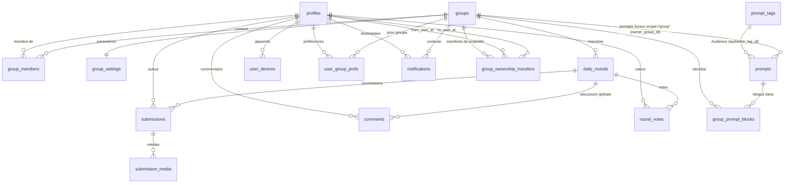
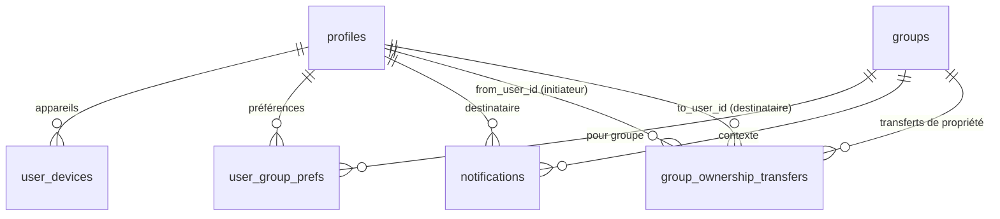

# 🗄️ Modèle de données (ERD)

## 🔗 Relations principales

## 📱 Notifications & Préférences

## 📊 Dictionnaire des tables (v1)

### 👤 Utilisateurs & Groupes

| Table              | Champs principaux                                                                                                           | Contraintes & remarques                                                                                                                                                                    |
| ------------------ | --------------------------------------------------------------------------------------------------------------------------- | ------------------------------------------------------------------------------------------------------------------------------------------------------------------------------------------ |
| **profiles**       | `id` (=auth), `display_name`, `image_url`, `created_at`, `updated_at`                                                       | FK → `auth.users(id)` ; `display_name` non vide ; `image_url` = URL absolue (Google ou Storage signée)                                                                                     |
| **groups**         | `name`, `owner_id`, `join_enabled`, `join_code`, `image_path`, `is_active`, `created_at`, `updated_at`                      | `owner_id` → `profiles` ; **invariant owner unique** ; `join_code` en clair **UNIQUE + normalisé UPPER** ; `image_path` = chemin Storage ; **heure française fixe** ; index sur `owner_id` |
| **group_members**  | `group_id`, `user_id`, `role` (`owner`\|`admin`\|`member`), `status` (`active`\|`inactive`\|`banned`\|`left`), `created_at` | `UNIQUE(group_id, user_id)` ; **1 seul `owner` actif** par groupe (index partiel) ; FK vers `groups` et `profiles`                                                                         |
| **group_settings** | `group_id` (PK), `drop_time` (HH:MM, nullable pour héritage app), `notifications_enabled` (bool, défaut `true`), `allow_global_prompts` (bool, défaut `true`)             | 1:1 avec `groups` ; **durée de manche fixe 1 jour local (constante applicative)** ; `allow_global_prompts` active la sélection mixte.                                                                                                         |

### 🎯 Catalogue & Manches (unifié)

| Table                    | Champs principaux                                                                                                                                                                                                                              | Contraintes & remarques                                                                                                                                                                     |
| ------------------------ | ---------------------------------------------------------------------------------------------------------------------------------------------------------------------------------------------------------------------------------------------- | ------------------------------------------------------------------------------------------------------------------------------------------------------------------------------------------- |
| **prompts**              | `id` (PK), `scope` (`global`\|`group`), `owner_group_id` (NULL si global), `type` (`question`\|`vote`\|`challenge`), `title`, `body`, `metadata` (jsonb), `status` (`pending`\|`approved`\|`rejected`\|`archived`), `is_enabled` (bool, défaut `true`), `audience_tag_id` (NULL, FK→`prompt_tags.id`), `min_group_size` (int, NULL), `max_group_size` (int, NULL), `created_by`, `reviewed_by`, `reviewed_at`, `created_at`, `updated_at` | Catalogue unique. Si `scope='group'` ⇒ `owner_group_id` NOT NULL. `is_enabled` sert au on/off (surtout pour les locaux) sans confondre avec l’archivage; les prompts globaux restent principalement gouvernés par le statut. |
| **group_prompt_blocks**  | `group_id`, `prompt_id`, `created_at`                                                                                                                            | V1: blocklist simple. `UNIQUE(group_id, prompt_id)` ; exclusion ponctuelle de la sélection ; pas de policy tri‑state. |
<!-- group_prompt_policies supprimé du modèle v1 -->
| **daily_rounds**         | `group_id`, `scheduled_for_local_date` (DATE FR), `status` (`scheduled`\|`open`\|`closed`), `open_at` (timestamptz), `close_at` (timestamptz), `source_prompt_id` (UUID, NULL), `resolved_type`, `resolved_title`, `resolved_body`, `resolved_metadata` (jsonb), `resolved_tags` (jsonb), `created_at`, `updated_at` | `UNIQUE(group_id, scheduled_for_local_date)` ; **exactement 1 jour local** entre `open_at` et `close_at`. Snapshot inline (immuable) dans `daily_rounds`; `source_prompt_id` sert aussi à l’anti‑répétition. |
| **submissions**          | `round_id`, `author_id`, `content_text`, `created_at`, `deleted_by_admin` (NULL), `deleted_at` (NULL)                                                                                                                                        | `UNIQUE(round_id, author_id)` ; définitives ; **soft delete admin** autorisé ; FK vers `daily_rounds` et `profiles`.                                                                        |
| **submission_media**     | `submission_id`, `storage_path`, `kind` (`image`\|`video`\|`audio`\|`file`), `metadata` (jsonb), `created_at`                                                                                                                              | 0..n médias par soumission ; validations de taille/format.                                                                                                                                  |

### 💬 Interactions

| Table           | Champs principaux                                                                                           | Contraintes & remarques                                                                       |
| --------------- | ----------------------------------------------------------------------------------------------------------- | --------------------------------------------------------------------------------------------- |
| **comments**    | `round_id`, `author_id`, `body`, `created_at`, `updated_at`, `deleted_at` (NULL), `deleted_by_admin` (NULL) | Éditables/supprimables **jusqu'à** fermeture ; **soft delete admin** autorisé après fermeture |
| **round_votes** | `round_id`, `voter_id`, `target_user_id`, `reason` (NULL), `created_at`                                     | `UNIQUE(round_id, voter_id)` ; **auto‑vote autorisé** ; `reason` libre et optionnel           |

### 🔔 Notifications & Préférences

| Table                         | Champs principaux                                                        | Contraintes & remarques                                                                 |
| ----------------------------- | ------------------------------------------------------------------------ | --------------------------------------------------------------------------------------- |
| **notifications**             | `user_id`, `group_id`, `type`, `payload` (jsonb), `status`, `created_at` | Types: `round_open`… ; file d'envoi ; `status` (`pending`\|`sent`\|`failed`)            |
| **user_devices**              | `user_id`, `platform` (`ios`\|`android`\|`web`), `token`, `created_at`   | **UNIQUE(token)** ; 1 token ne peut appartenir qu'à un seul compte                      |
| **user_group_prefs**          | `user_id`, `group_id`, `mute` (bool), `push` (bool)                      | `UNIQUE(user_id, group_id)` ; préférences par groupe                                    |
| **group_ownership_transfers** | `group_id`, `from_user_id`, `to_user_id`, `status`, `created_at`         | Transferts de propriété avec acceptation ; `status` (`pending`\|`accepted`\|`rejected`) |

### 🏷️ Taxonomie (V1)

| Table           | Champs principaux                                   | Contraintes & remarques |
| --------------- | --------------------------------------------------- | ------------------------ |
| **prompt_tags** | `id`, `name`, `category` (`audience`)               | Liste curatée; ex. **Audience**: `couple`, `friends`, `family`, `coworkers`, `roommates`. |
| **prompts**     | `audience_tag_id` (NULL, FK→`prompt_tags.id`)       | V1: une seule facette utilisée (Audience). Pas de table d’association. Vérifier côté DB/app que le tag référencé a bien `category='audience'` (contrainte applicative). |

#### Facette unique (Audience)

- **Audience**: couple, friends, family, coworkers, roommates…
 
 

#### Cardinalité

- Un seul tag par prompt pour la facette `audience` (0 ou 1 via `audience_tag_id`).
- `type` reste une colonne (`question`|`vote`|`challenge`) — pas de facette `modality`.
 

Note: “couple” et “friends” sont des valeurs de la facette **Audience**. Éviter de les mélanger avec des thèmes/tons/modalités. Ne pas inclure de facette “Seasonality / Event”.

Note: le tag Audience est informatif pour v1; aucune préférence d’audience au niveau groupe en v1.

## ⚖️ Contraintes métier (DB & applicatif)

- **1 round/jour/groupe** : `UNIQUE(group_id, scheduled_for_local_date)`
- **1 soumission/user/round** : `UNIQUE(round_id, author_id)`
- **1 vote/user/round** : `UNIQUE(round_id, voter_id)`
- **Owner unique** : index partiel `UNIQUE(group_id) WHERE role='owner'` dans `group_members`
- **Sélection quotidienne** : candidats = prompts `scope='group'` (owner_group_id=group_id) avec `status='approved'` ET `is_enabled=true` + (si `allow_global_prompts=true`) prompts `scope='global'` approuvés; exclure les prompts présents dans `group_prompt_blocks`; anti‑répétition N=7 calculée à la volée via `daily_rounds.source_prompt_id`.

## 🕐 Gestion des temps, fuseaux et DST

### Problématique

Le calcul `close_at = open_at + INTERVAL '24 hours'` pose problème lors des changements d'heure (DST) car :

- Les jours peuvent faire 23h ou 25h lors des transitions DST
- Cela provoque une dérive si on relie la création à "24h après fermeture"
- Le comportement n'est pas intuitif pour les utilisateurs

### Solution implémentée

**Stockage** :

- `group_settings.drop_time` : heure française (TIME sans timezone, ex: "14:30")
- `daily_rounds.scheduled_for_local_date` : date française
- **Fuseau fixe** : Toute l'application fonctionne en heure française (Europe/Paris)

**Calcul des horaires** :

1. `open_at` = ZonedDateTime(date_française, drop_time, "Europe/Paris") → UTC
2. `close_at` = ZonedDateTime(date_française+1, drop_time, "Europe/Paris") → UTC

**Clé d'unicité** : `UNIQUE(group_id, scheduled_for_local_date)`

**Bénéfices** :

- Pas de dérive temporelle
- Comportement intuitif lors des changements d'heure DST
- Simplicité produit : "un prompt par jour en heure française"
- Cohérence : toujours à la même heure française
- **Architecture simplifiée** : pas de gestion multi-fuseaux

### Règle de création de manche

**Invariant simple** :

- **Création J à J-1** : Un round pour le jour J est créé la veille (J-1) à l'heure `drop_time`
- **Condition unique** : s'il n'existe pas encore de `daily_round` pour `(group_id, scheduled_for_local_date=J)`
- **Jobs fréquents** : Toutes les 5-10 min en at-least-once + idempotence
- **Pas de dépendance** : Aucune relation avec l'heure de fermeture de la manche précédente

**Avantages** :

- ✅ **Simplicité** : Une seule règle claire
- ✅ **Prévisibilité** : Création systématique pour chaque jour français
- ✅ **Robustesse** : Pas de dérive temporelle
- ✅ **Idempotence** : Peut tourner à haute fréquence sans risque

**Migration** : remplacer toutes les mentions "24h après fermeture" par "un round par jour français à l'heure drop_time"

### Configuration anti-répétition

**Fenêtre d'exclusion** : N=7 derniers prompts utilisés par défaut

- Paramétrable via constante applicative
- Évite la monotonie tout en permettant la rotation
- Si moins de N prompts actifs, sélection parmi tous les disponibles
- Si aucun prompt éligible n'est disponible à J-1, créer le `daily_round` en `scheduled` sans snapshot et retenter la sélection à l'ouverture; aucune notification n'est envoyée tant que le snapshot n'est pas créé

## 🔐 Règles de sécurité

- **Appartenance stricte** : Toute action (soumettre/commenter/voter) requiert membership du groupe
- **Owner unique** : Exactement 1 owner par groupe, non révoquable sans transfert
- **Heure française fixe** : Toute l'application en Europe/Paris, planification française, stockage UTC
 

## 🔒 Row Level Security (RLS)

Les principes et l’implémentation détaillée des politiques RLS (visibilité conditionnelle, participation, rôles) sont documentés ici:

- `docs/rls-policies.md`

## 🔐 Intégrité et contrôle d'accès

### M1 - Contraintes croisées (actions ⇒ membre du groupe)

**Objectif** : Empêcher soumissions/commentaires/votes d'utilisateurs non-membres du groupe.

**Implémentation** : Politiques RLS vérifiant l'appartenance au groupe avant toute action.

### M2 - Owner unique et toujours membre

**Objectif** : Garantir qu'il y a toujours exactement 1 owner par groupe.

**Implémentation** : Index partiel d'unicité (owner unique). Détails d'intégrité dans `docs/db-indexes-triggers.md`.

## 📈 Index de performance (Synthèse)

- [Rounds](docs/db-indexes-triggers.md#rounds): UNIQUE `(group_id, scheduled_for_local_date)`; `(status, open_at)`; `(status, close_at)`; `(group_id, open_at DESC)`.
- [Prompts](docs/db-indexes-triggers.md#prompts): `(owner_group_id, status, is_enabled)`; `(scope, status)`.
- [Groupes & Membership](docs/db-indexes-triggers.md#groupes-membership): UNIQUE `group_members (group_id, user_id)`; `group_members (group_id, user_id, status)`; `group_members (user_id)`; UNIQUE partiel owner `group_members (group_id) WHERE role='owner' AND status='active'`; `groups (owner_id)`; UNIQUE `groups (join_code)`.
- [Interactions](docs/db-indexes-triggers.md#interactions): UNIQUE `submissions (round_id, author_id)`; `submissions (round_id, created_at)`; UNIQUE `round_votes (round_id, voter_id)`; `round_votes (round_id, target_user_id)`; `comments (round_id, created_at)`; `submission_media (submission_id)`.
- [Notifications & Préférences](docs/db-indexes-triggers.md#notifications-preferences): `notifications (status, created_at)`; `notifications (user_id, status)`; UNIQUE `user_devices (token)`; `user_devices (user_id)`; PRIMARY KEY `user_group_prefs (user_id, group_id)`.
- [Transferts](docs/db-indexes-triggers.md#transferts): `group_ownership_transfers (group_id, status)`; `(to_user_id, status)`.

Détails et rationales: `docs/db-indexes-triggers.md`.

## 🔐 Triggers — Synthèse

- [Groupes](docs/db-indexes-triggers.md#groupes): `groups_join_code_normalize`; `touch_groups_updated_at`.
- [Membership](docs/db-indexes-triggers.md#membership): `protect_last_owner`.
- [Rounds](docs/db-indexes-triggers.md#rounds-triggers): `lock_round_snapshot_after_open`.
- [Soumissions](docs/db-indexes-triggers.md#soumissions): `submissions_author_immutable`.
- [Commentaires](docs/db-indexes-triggers.md#commentaires): `comments_edit_window`; `touch_comments_updated_at`.
- [Votes](docs/db-indexes-triggers.md#votes): `votes_insert_guard`; `votes_immutable`.

Détails: `docs/db-indexes-triggers.md`.

## 🗑️ Suppression en cascade

- **ON DELETE CASCADE** activé sur toutes les FK vers `groups.id` :
  - `group_members.group_id` → suppression des membres
  - `group_settings.group_id` → suppression des paramètres
  - `daily_rounds.group_id` → suppression des manches
  - `prompts.owner_group_id` → suppression des prompts locaux
  - `group_ownership_transfers.group_id` → suppression des transferts
  - `user_group_prefs.group_id` → suppression des préférences
  - `notifications.group_id` → suppression des notifications
- **Suppression Storage asynchrone** : Images de groupe et médias associés supprimés en arrière-plan
- **Suppression transitive** : Les FK des tables liées aux manches sont aussi supprimées (submissions, comments, votes, etc.)
- **Prompts globaux conservés** : Les prompts `scope='global'` (avec `owner_group_id IS NULL`) ne sont pas affectés par la suppression d'un groupe.

## 🔧 DDL — références

- Ajouts/contraintes et index sont gérés via les migrations.
- Références clés:
  - `prompts.is_enabled` (bool par défaut true) pour activer/désactiver un prompt.
  - `prompts.audience_tag_id` (FK → `prompt_tags.id`) pour la facette Audience.
  - `group_prompt_blocks(group_id, prompt_id)` avec contrainte d’unicité pour la blocklist V1.
  - Index RLS de participation: composites sur `submissions` et `round_votes` pour la visibilité conditionnelle.
  - Optionnel V1.1: vue matérialisée `round_participations` (UNIQUE (round_id, user_id)) rafraîchie planifié.
-
Voir les fichiers de migration pour les détails d’implémentation.

### Sémantique `status` vs `is_enabled`

- **status** : cycle de vie et modération (pending/approved/rejected/archived)
- **is_enabled** : interrupteur d’éligibilité à la sélection automatique (surtout pour les prompts locaux)
- Sélection locale = `status='approved' AND is_enabled=true`
- Archiver (`status='archived'`) sort le prompt du catalogue; désactiver (`is_enabled=false`) le garde visible mais non-sélectionnable
