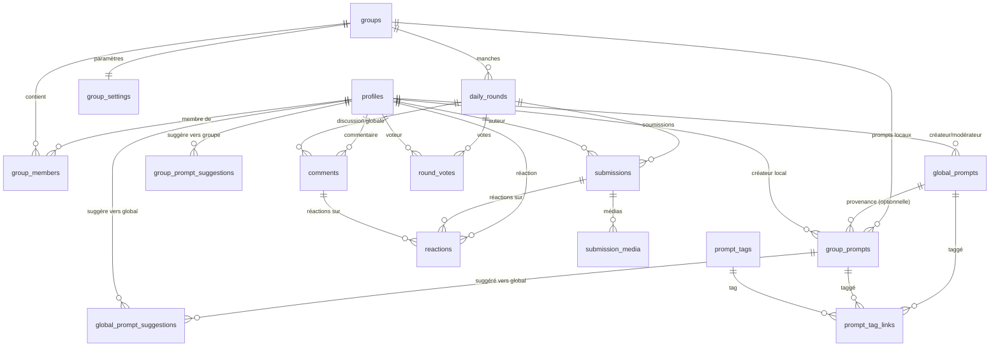
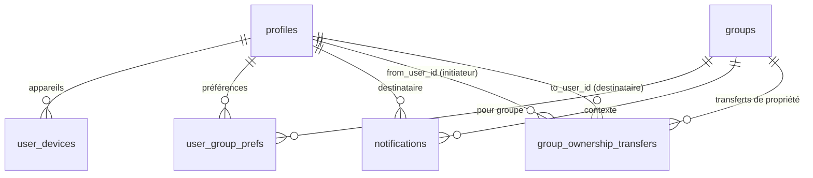

# 🗄️ Modèle de données (ERD)

## 🔗 Relations principales

## 📱 Notifications & Préférences

## 📊 Dictionnaire des tables (v1)

### 👤 Utilisateurs & Groupes

| Table              | Champs principaux                                                                                                                    | Contraintes & remarques                                                                                                                                                                    |
| ------------------ | ------------------------------------------------------------------------------------------------------------------------------------ | ------------------------------------------------------------------------------------------------------------------------------------------------------------------------------------------ |
| **profiles**       | `id` (=auth), `display_name`, `image_url`, `created_at`, `updated_at`                                                                | FK → `auth.users(id)` ; `display_name` non vide ; `image_url` = URL absolue (Google ou Storage signée)                                                                                     |
| **groups**         | `name`, `type` (`friends`\|`couple`), `owner_id`, `join_enabled`, `join_code`, `image_path`, `is_active`, `created_at`, `updated_at` | `owner_id` → `profiles` ; **invariant owner unique** ; `join_code` en clair **UNIQUE + normalisé UPPER** ; `image_path` = chemin Storage ; **heure française fixe** ; index sur `owner_id` |
| **group_members**  | `group_id`, `user_id`, `role` (`owner`\|`admin`\|`member`), `status` (`active`\|`inactive`\|`banned`\|`left`), `created_at`          | `UNIQUE(group_id, user_id)` ; **1 seul `owner` actif** par groupe (index partiel) ; FK vers `groups` et `profiles`                                                                         |
| **group_settings** | `group_id` (PK), `drop_time` (HH:MM, nullable pour héritage app), `notifications_enabled` (bool, défaut `true`)                      | 1:1 avec `groups` ; **durée de manche fixe 1 jour local (constante applicative)**                                                                                                          |

### 🎯 Prompts & Manches

| Table                         | Champs principaux                                                                                                                                                                                             | Contraintes & remarques                                                                                                                                 |
| ----------------------------- | ------------------------------------------------------------------------------------------------------------------------------------------------------------------------------------------------------------- | ------------------------------------------------------------------------------------------------------------------------------------------------------- |
| **global_prompts**            | `type` (`question`\|`vote`\|`challenge`), `title`, `body`, `status` (`pending`\|`approved`\|`rejected`\|`archived`), `created_by`, `reviewed_by`, `reviewed_at`, `feedback`, `metadata` (jsonb), `created_at` | Banque globale curatée ; **v1 non utilisée pour la sélection quotidienne**                                                                              |
| **group_prompts**             | `group_id`, `type`, `title`, `body`, `is_active` (bool), `cloned_from_global` (nullable), `created_by`, `metadata` (jsonb), `created_at`, `updated_at`                                                        | Prompts locaux (créés par owner/admin). `cloned_from_global` = provenance _optionnelle_ (non clonable en UI v1)                                         |
| **group_prompt_suggestions**  | `group_id`, `suggested_by`, `title`, `body`, `type`, `status` (`pending`\|`approved`\|`rejected`), `feedback`, `created_at`, `updated_at`                                                                     | Suggestions **membres → banque locale** (modération owner/admin)                                                                                        |
| **global_prompt_suggestions** | `group_prompt_id`, `suggested_by`, `status` (`pending`\|`approved`\|`rejected`), `feedback`, `created_at`, `updated_at`                                                                                       | Suggestions **prompts locaux → banque globale** (modération app creator)                                                                                |
| **daily_rounds**              | `group_id`, `group_prompt_id`, `scheduled_for_local_date` (DATE), `status` (`scheduled`\|`open`\|`closed`), `open_at` (timestamptz), `close_at` (timestamptz), `created_at`, `updated_at`                     | `UNIQUE(group_id, scheduled_for_local_date)` ; **exactement 1 jour local** entre `open_at` et `close_at` ; **pas de lien direct vers `global_prompts`** |
| **submissions**               | `round_id`, `author_id`, `content_text`, `created_at`, `deleted_by_admin` (NULL), `deleted_at` (NULL)                                                                                                         | `UNIQUE(round_id, author_id)` ; définitives ; **soft delete admin** autorisé ; FK vers `daily_rounds` et `profiles`                                     |
| **submission_media**          | `submission_id`, `storage_path`, `kind` (`image`\|`video`\|`audio`\|`file`), `metadata` (jsonb), `created_at`                                                                                                 | 0..n médias par soumission ; validations de taille/format                                                                                               |

### 💬 Interactions

| Table           | Champs principaux                                                                                           | Contraintes & remarques                                                                       |
| --------------- | ----------------------------------------------------------------------------------------------------------- | --------------------------------------------------------------------------------------------- |
| **comments**    | `round_id`, `author_id`, `body`, `created_at`, `updated_at`, `deleted_at` (NULL), `deleted_by_admin` (NULL) | Éditables/supprimables **jusqu'à** fermeture ; **soft delete admin** autorisé après fermeture |
| **round_votes** | `round_id`, `voter_id`, `target_user_id`, `reason` (NULL), `created_at`                                     | `UNIQUE(round_id, voter_id)` ; **auto‑vote autorisé** ; `reason` libre et optionnel           |
| **reactions**   | `entity_type` (`submission`\|`comment`), `entity_id`, `user_id`, `type`, `created_at`                       | `UNIQUE(entity_type, entity_id, user_id, type)` ; réactions typées (ex: like, haha, wow…)     |

### 🔔 Notifications & Préférences

| Table                         | Champs principaux                                                        | Contraintes & remarques                                                                 |
| ----------------------------- | ------------------------------------------------------------------------ | --------------------------------------------------------------------------------------- |
| **notifications**             | `user_id`, `group_id`, `type`, `payload` (jsonb), `status`, `created_at` | Types: `round_open`… ; file d'envoi ; `status` (`pending`\|`sent`\|`failed`)            |
| **user_devices**              | `user_id`, `platform` (`ios`\|`android`\|`web`), `token`, `created_at`   | **UNIQUE(token)** ; 1 token ne peut appartenir qu'à un seul compte                      |
| **user_group_prefs**          | `user_id`, `group_id`, `mute` (bool), `push` (bool)                      | `UNIQUE(user_id, group_id)` ; préférences par groupe                                    |
| **group_ownership_transfers** | `group_id`, `from_user_id`, `to_user_id`, `status`, `created_at`         | Transferts de propriété avec acceptation ; `status` (`pending`\|`accepted`\|`rejected`) |

### 🏷️ Tagging

| Table                | Champs principaux                                  | Contraintes & remarques                                    |
| -------------------- | -------------------------------------------------- | ---------------------------------------------------------- |
| **prompt_tags**      | `id`, `name`                                       | Tags libres (langue, thème, ton, difficulté…)              |
| **prompt_tag_links** | `prompt_id`, `scope` (`global`\|`group`), `tag_id` | Lien polymorphe : (`scope`, `prompt_id`) + `tag_id` unique |

## ⚖️ Contraintes métier (DB & applicatif)

- **1 round/jour/groupe** : `UNIQUE(group_id, scheduled_for_local_date)`
- **1 soumission/user/round** : `UNIQUE(round_id, author_id)`
- **1 vote/user/round** : `UNIQUE(round_id, voter_id)`
- **Owner unique** : index partiel `UNIQUE(group_id) WHERE role='owner'` dans `group_members`
- **Réactions typées uniques** : `UNIQUE(entity_type, entity_id, user_id, type)`
- **Sélection quotidienne v1** : prompts **locaux** avec `is_active=true` ; exclusion des `N` derniers prompts utilisés par le groupe (fenêtre glissante)

## 🕐 Gestion des temps, fuseaux et DST

### Problématique

Le calcul `close_at = open_at + INTERVAL '24 hours'` pose problème lors des changements d'heure (DST) car :

- Les jours peuvent faire 23h ou 25h lors des transitions DST
- Cela provoque une dérive si on relie la création à "24h après fermeture"
- Le comportement n'est pas intuitif pour les utilisateurs

### Solution implémentée

**Stockage** :

- `group_settings.drop_time` : heure française (TIME sans timezone, ex: "14:30")
- `daily_rounds.scheduled_for_local_date` : date française
- **Fuseau fixe** : Toute l'application fonctionne en heure française (Europe/Paris)

**Calcul des horaires** :

1. `open_at` = ZonedDateTime(date_française, drop_time, "Europe/Paris") → UTC
2. `close_at` = ZonedDateTime(date_française+1, drop_time, "Europe/Paris") → UTC

**Clé d'unicité** : `UNIQUE(group_id, scheduled_for_local_date)`

**Bénéfices** :

- Pas de dérive temporelle
- Comportement intuitif lors des changements d'heure DST
- Simplicité produit : "un prompt par jour en heure française"
- Cohérence : toujours à la même heure française
- **Architecture simplifiée** : pas de gestion multi-fuseaux

### Règle de création de manche

**Invariant simple** :

- Création d'un round pour le jour J à J-1, à l'heure `drop_time` (heure française)
- Condition : s'il n'existe pas encore de `daily_round` pour `(group_id, scheduled_for_local_date=J)`
- Jobs en at-least-once + idempotence (fréquence: toutes les 5-10 min)

**Migration** : remplacer toutes les mentions "24h après fermeture" par "un round par jour français à l'heure drop_time"

### Configuration anti-répétition

**Fenêtre d'exclusion** : N=7 derniers prompts utilisés par défaut

- Paramétrable via constante applicative
- Évite la monotonie tout en permettant la rotation
- Si moins de N prompts actifs, sélection parmi tous les disponibles

## 🔐 Règles de sécurité

- **Appartenance stricte** : Toute action (soumettre/commenter/réagir/voter) requiert membership du groupe
- **Owner unique** : Exactement 1 owner par groupe, non révoquable sans transfert
- **Heure française fixe** : Toute l'application en Europe/Paris, planification française, stockage UTC
- **Prompts éligibles v1** : **seulement** `group_prompts.is_active=true`

## 🔒 Row Level Security (RLS) - Visibilité conditionnelle

**Principe** : Les interactions d'une manche ne sont visibles qu'après avoir soumis sa propre réponse.

### Politiques de visibilité

- **`submissions`** : Visibles si le round est fermé OU si l'utilisateur a déjà soumis sa réponse
- **`comments`** : Visibles si le round est fermé OU si l'utilisateur a soumis dans ce round
- **`reactions`** : Visibles si le round est fermé OU si l'utilisateur a soumis dans ce round
- **`round_votes`** : Visibles si le round est fermé OU si l'utilisateur a soumis dans ce round

### Mécanisme de gamification

Cette approche crée un **effet de mystère** qui encourage la participation :

1. L'utilisateur voit le prompt mais pas les réponses des autres
2. Il doit soumettre sa propre réponse pour débloquer le contenu
3. Une fois sa réponse soumise, tout devient visible en temps réel
4. Après fermeture du round, tout reste consultable par tous les membres

## 🔐 Triggers de contrôle temporel

**Objectif** : Empêcher l'édition/suppression des commentaires après fermeture du round.
**Exception** : Les admins/owners peuvent effectuer un soft delete pour modération.

### Règles de modération admin

**Soft delete admin** : Mécanisme de modération après fermeture

- **Champs** : `deleted_by_admin` (user_id), `deleted_at` (timestamp)
- **Trigger exception** : Autorise UPDATE si `deleted_by_admin: NULL → NOT NULL`
- **Affichage** : Commentaires soft deleted masqués pour tous les membres
- **Permissions** : Seuls owner/admin du groupe peuvent modérer
- **Traçabilité** : Conservation de l'ID du modérateur pour audit

### Triggers implémentés

- **`comments`** : Empêche modification/suppression auteur après fermeture, autorise soft delete admin (`deleted_by_admin`, `deleted_at`)
- **`round_votes`** : Bloque toute modification des votes (définitifs) + validation d'intégrité à l'insertion
- **`submissions`** : Empêche modification/suppression des soumissions, sauf soft delete admin
- **`reactions`** : Contrôle temporel similaire aux commentaires (si édition autorisée)
- **`daily_rounds`** : Validation cohérence round ↔ prompt (même groupe)
- **`groups`** : Normalisation automatique des `join_code` en UPPER + validation format

## 🔐 Intégrité et contrôle d'accès

### M1 - Contraintes croisées (actions ⇒ membre du groupe)

**Objectif** : Empêcher soumissions/commentaires/votes d'utilisateurs non-membres du groupe.

**Implémentation** : Triggers de validation ou politiques RLS vérifiant l'appartenance au groupe avant toute action.

### M2 - Owner unique et toujours membre

**Objectif** : Garantir qu'il y a toujours exactement 1 owner par groupe.

**Implémentation** : Index partiel d'unicité + triggers empêchant la suppression du dernier owner actif.

## 📈 Index de performance

### Index stratégiques

- **Activité utilisateur** : `author_id`, `voter_id`, `user_id` sur les tables d'interaction
- **Support RLS** : Index composites `(round_id, author_id)` pour la visibilité conditionnelle
- **Jointures fréquentes** : `(group_id, user_id, status)` pour les vérifications de membership
- **Jobs automatisés** : Index sur `status` et `close_at` pour les rounds ouverts
- **Notifications** : Index partiel sur les notifications non lues
- **Recherche d'entités** : Index sur `(entity_type, entity_id)` pour les réactions

## 🗑️ Suppression en cascade

- **ON DELETE CASCADE** activé sur toutes les FK vers `groups.id` :
  - `group_members.group_id` → suppression des membres
  - `group_settings.group_id` → suppression des paramètres
  - `daily_rounds.group_id` → suppression des manches
  - `group_prompts.group_id` → suppression des prompts locaux
  - `group_prompt_suggestions.group_id` → suppression des suggestions locales
  - `group_ownership_transfers.group_id` → suppression des transferts
  - `user_group_prefs.group_id` → suppression des préférences
  - `notifications.group_id` → suppression des notifications
- **Suppression Storage asynchrone** : Images de groupe et médias associés supprimés en arrière-plan
- **Suppression transitive** : Les FK des tables liées aux manches sont aussi supprimées (submissions, comments, votes, reactions, etc.)
