# 🗄️ Modèle de données (ERD)

## 🔗 Relations principales


## 📱 Notifications & Préférences

```mermaid
erDiagram
    profiles ||--o{ user_devices : "appareils"
    profiles ||--o{ user_group_prefs : "préférences"
    groups ||--o{ user_group_prefs : "pour groupe"
    profiles ||--o{ notifications : "destinataire"
    groups ||--o{ notifications : "contexte"
    groups ||--o{ group_ownership_transfers : "transferts de propriété"
    profiles ||--o{ group_ownership_transfers : "from_user_id (initiateur)"
    profiles ||--o{ group_ownership_transfers : "to_user_id (destinataire)"
```



## 📊 Dictionnaire des tables (v1)

### 👤 Utilisateurs & Groupes

| Table              | Champs principaux                                                                                                                                | Contraintes & remarques                                                                                                                             |
| ------------------ | ------------------------------------------------------------------------------------------------------------------------------------------------ | --------------------------------------------------------------------------------------------------------------------------------------------------- |
| **profiles**       | `id` (=auth), `display_name`, `image_path`, `created_at`, `updated_at`                                                                           | FK → `auth.users(id)` ; `display_name` non vide ; avatar Google ou personnalisé                                                                     |
| **groups**         | `name`, `type` (`friends`\|`couple`), `owner_id`, `timezone`, `join_enabled`, `join_code`, `image_path`, `is_active`, `created_at`, `updated_at` | `owner_id` → `profiles` ; **invariant owner unique** ; `join_code` en clair **UNIQUE + normalisé UPPER** ; **timezone figé** ; index sur `owner_id` |
| **group_members**  | `group_id`, `user_id`, `role` (`owner`\|`admin`\|`member`), `status` (`active`\|`inactive`\|`banned`\|`left`), `created_at`                      | `UNIQUE(group_id, user_id)` ; **1 seul `owner` actif** par groupe (index partiel) ; FK vers `groups` et `profiles`                                  |
| **group_settings** | `group_id` (PK), `drop_time` (HH:MM, nullable pour héritage app), `notifications_enabled` (bool, défaut `true`)                                  | 1:1 avec `groups` ; **durée de manche fixe 24h (constante applicative)**                                                                            |

### 🎯 Prompts & Manches

| Table                         | Champs principaux                                                                                                                                                                                             | Contraintes & remarques                                                                                                             |
| ----------------------------- | ------------------------------------------------------------------------------------------------------------------------------------------------------------------------------------------------------------- | ----------------------------------------------------------------------------------------------------------------------------------- |
| **global_prompts**            | `type` (`question`\|`vote`\|`challenge`), `title`, `body`, `status` (`pending`\|`approved`\|`rejected`\|`archived`), `created_by`, `reviewed_by`, `reviewed_at`, `feedback`, `metadata` (jsonb), `created_at` | Banque globale curatée ; **v1 non utilisée pour la sélection quotidienne** ; historique des modifs                                  |
| **group_prompts**             | `group_id`, `type`, `title`, `body`, `is_active` (bool), `cloned_from_global` (nullable), `created_by`, `metadata` (jsonb), `created_at`, `updated_at`                                                        | Prompts locaux (créés par owner/admin). `cloned_from_global` = provenance _optionnelle_ (non clonable en UI v1)                     |
| **group_prompt_suggestions**  | `group_id`, `suggested_by`, `title`, `body`, `type`, `status` (`pending`\|`approved`\|`rejected`), `feedback`, `created_at`, `updated_at`                                                                     | Suggestions **membres → banque locale** (modération owner/admin)                                                                    |
| **global_prompt_suggestions** | `group_prompt_id`, `suggested_by`, `status` (`pending`\|`approved`\|`rejected`), `feedback`, `created_at`, `updated_at`                                                                                       | Suggestions **prompts locaux → banque globale** (modération app creator)                                                            |
| **daily_rounds**              | `group_id`, `group_prompt_id`, `scheduled_for` (DATE), `status` (`scheduled`\|`open`\|`closed`), `open_at` (timestamptz), `close_at` (timestamptz), `created_at`, `updated_at`                                | `UNIQUE(group_id, scheduled_for)` ; **exactement 24h** entre `open_at` et `close_at` ; **pas de lien direct vers `global_prompts`** |
| **submissions**               | `round_id`, `author_id`, `content_text`, `created_at`, `deleted_by_admin` (NULL), `deleted_at` (NULL)                                                                                                         | `UNIQUE(round_id, author_id)` ; définitives ; **soft delete admin** autorisé ; FK vers `daily_rounds` et `profiles`                 |
| **submission_media**          | `submission_id`, `storage_path`, `kind` (`image`\|`video`\|`audio`\|`file`), `metadata` (jsonb), `created_at`                                                                                                 | 0..n médias par soumission ; validations de taille/format                                                                           |

### 💬 Interactions

| Table           | Champs principaux                                                                                           | Contraintes & remarques                                                                       |
| --------------- | ----------------------------------------------------------------------------------------------------------- | --------------------------------------------------------------------------------------------- |
| **comments**    | `round_id`, `author_id`, `body`, `created_at`, `updated_at`, `deleted_at` (NULL), `deleted_by_admin` (NULL) | Éditables/supprimables **jusqu'à** fermeture ; **soft delete admin** autorisé après fermeture |
| **round_votes** | `round_id`, `voter_id`, `target_user_id`, `reason` (NULL), `created_at`                                     | `UNIQUE(round_id, voter_id)` ; **auto‑vote autorisé** ; `reason` libre et optionnel           |
| **reactions**   | `entity_type` (`submission`\|`comment`), `entity_id`, `user_id`, `type`, `created_at`                       | `UNIQUE(entity_type, entity_id, user_id, type)` ; réactions typées (ex: like, haha, wow…)     |

### 🔔 Notifications & Préférences

| Table                         | Champs principaux                                                        | Contraintes & remarques                                                                 |
| ----------------------------- | ------------------------------------------------------------------------ | --------------------------------------------------------------------------------------- |
| **notifications**             | `user_id`, `group_id`, `type`, `payload` (jsonb), `status`, `created_at` | Types: `round_open`… ; file d'envoi ; `status` (`pending`\|`sent`\|`failed`)            |
| **user_devices**              | `user_id`, `platform` (`ios`\|`android`\|`web`), `token`, `created_at`   | **UNIQUE(token)** ; 1 token ne peut appartenir qu'à un seul compte                      |
| **user_group_prefs**          | `user_id`, `group_id`, `mute` (bool), `push` (bool)                      | `UNIQUE(user_id, group_id)` ; préférences par groupe                                    |
| **group_ownership_transfers** | `group_id`, `from_user_id`, `to_user_id`, `status`, `created_at`         | Transferts de propriété avec acceptation ; `status` (`pending`\|`accepted`\|`rejected`) |

### 🏷️ Tagging

| Table                | Champs principaux                                  | Contraintes & remarques                                    |
| -------------------- | -------------------------------------------------- | ---------------------------------------------------------- |
| **prompt_tags**      | `id`, `name`                                       | Tags libres (langue, thème, ton, difficulté…)              |
| **prompt_tag_links** | `prompt_id`, `scope` (`global`\|`group`), `tag_id` | Lien polymorphe : (`scope`, `prompt_id`) + `tag_id` unique |

## ⚖️ Contraintes métier (DB & applicatif)

- **1 round/jour/groupe** : `UNIQUE(group_id, scheduled_for)`
- **1 soumission/user/round** : `UNIQUE(round_id, author_id)`
- **1 vote/user/round** : `UNIQUE(round_id, voter_id)`
- **Owner unique** : index partiel `UNIQUE(group_id) WHERE role='owner'` dans `group_members`
- **Réactions typées uniques** : `UNIQUE(entity_type, entity_id, user_id, type)`
- **Sélection quotidienne v1** : prompts **locaux** avec `is_active=true` ; exclusion des `N` derniers prompts utilisés par le groupe (fenêtre glissante)

## 🔐 Règles de sécurité

- **Appartenance stricte** : Toute action (soumettre/commenter/réagir/voter) requiert membership du groupe
- **Owner unique** : Exactement 1 owner par groupe, non révoquable sans transfert
- **Fuseau horaire** : Défini à la création (non modifiable), planification locale, stockage UTC
- **Prompts éligibles v1** : **seulement** `group_prompts.is_active=true`

## 🔒 Row Level Security (RLS) - Visibilité conditionnelle

**Principe** : Les interactions d'une manche ne sont visibles qu'après avoir soumis sa propre réponse.

### Politique RLS pour `submissions`

```sql
-- SELECT autorisé si round fermé OU si j'ai déjà soumis
CREATE POLICY "submissions_visibility" ON submissions FOR SELECT
USING (
  EXISTS (
    SELECT 1 FROM daily_rounds dr
    WHERE dr.id = submissions.round_id
    AND dr.status = 'closed'
  )
  OR EXISTS (
    SELECT 1 FROM submissions s2
    WHERE s2.round_id = submissions.round_id
    AND s2.author_id = auth.uid()
  )
);
```

### Politique RLS pour `comments`

```sql
-- SELECT autorisé si round fermé OU si j'ai soumis dans ce round
CREATE POLICY "comments_visibility" ON comments FOR SELECT
USING (
  EXISTS (
    SELECT 1 FROM daily_rounds dr
    WHERE dr.id = comments.round_id
    AND dr.status = 'closed'
  )
  OR EXISTS (
    SELECT 1 FROM submissions s
    WHERE s.round_id = comments.round_id
    AND s.author_id = auth.uid()
  )
);
```

### Politique RLS pour `reactions`

```sql
-- SELECT autorisé si round fermé OU si j'ai soumis dans ce round
CREATE POLICY "reactions_visibility" ON reactions FOR SELECT
USING (
  EXISTS (
    SELECT 1 FROM daily_rounds dr
    JOIN submissions sub ON sub.round_id = dr.id
    WHERE (
      (reactions.entity_type = 'submission' AND reactions.entity_id = sub.id)
      OR (reactions.entity_type = 'comment' AND EXISTS (
        SELECT 1 FROM comments c WHERE c.id = reactions.entity_id AND c.round_id = dr.id
      ))
    )
    AND dr.status = 'closed'
  )
  OR EXISTS (
    SELECT 1 FROM daily_rounds dr
    JOIN submissions sub ON sub.round_id = dr.id
    JOIN submissions my_sub ON my_sub.round_id = dr.id AND my_sub.author_id = auth.uid()
    WHERE (
      (reactions.entity_type = 'submission' AND reactions.entity_id = sub.id)
      OR (reactions.entity_type = 'comment' AND EXISTS (
        SELECT 1 FROM comments c WHERE c.id = reactions.entity_id AND c.round_id = dr.id
      ))
    )
  )
);
```

### Politique RLS pour `round_votes`

```sql
-- SELECT autorisé si round fermé OU si j'ai soumis dans ce round
CREATE POLICY "votes_visibility" ON round_votes FOR SELECT
USING (
  EXISTS (
    SELECT 1 FROM daily_rounds dr
    WHERE dr.id = round_votes.round_id
    AND dr.status = 'closed'
  )
  OR EXISTS (
    SELECT 1 FROM submissions s
    WHERE s.round_id = round_votes.round_id
    AND s.author_id = auth.uid()
  )
);
```

## 🔐 Triggers de contrôle temporel

**Objectif** : Empêcher l'édition/suppression des commentaires après fermeture du round.
**Exception** : Les admins/owners peuvent effectuer un soft delete pour modération.

### Trigger pour `comments`

```sql
-- Fonction de validation avec exception admin
CREATE OR REPLACE FUNCTION check_round_not_closed_or_admin()
RETURNS TRIGGER AS $$
BEGIN
  -- Vérifier si le round est fermé
  IF EXISTS (
    SELECT 1 FROM daily_rounds dr
    WHERE dr.id = COALESCE(NEW.round_id, OLD.round_id)
    AND dr.status = 'closed'
  ) THEN
    -- Exception pour soft delete admin (UPDATE avec deleted_by_admin)
    IF TG_OP = 'UPDATE' AND NEW.deleted_by_admin IS NOT NULL AND OLD.deleted_by_admin IS NULL THEN
      -- Vérifier que l'utilisateur est admin/owner du groupe
      IF EXISTS (
        SELECT 1 FROM daily_rounds dr
        JOIN group_members gm ON gm.group_id = dr.group_id
        WHERE dr.id = NEW.round_id
        AND gm.user_id = auth.uid()
        AND gm.role IN ('owner', 'admin')
        AND gm.status = 'active'
      ) THEN
        RETURN NEW; -- Autoriser soft delete admin
      END IF;
    END IF;

    RAISE EXCEPTION 'Cannot modify comments after round is closed (except admin soft delete)';
  END IF;

  RETURN COALESCE(NEW, OLD);
END;
$$ LANGUAGE plpgsql;

-- Trigger BEFORE UPDATE sur comments (avec exception admin)
CREATE TRIGGER comments_update_check
  BEFORE UPDATE ON comments
  FOR EACH ROW
  EXECUTE FUNCTION check_round_not_closed_or_admin();

-- Trigger BEFORE DELETE sur comments (hard delete interdit après fermeture)
CREATE TRIGGER comments_delete_check
  BEFORE DELETE ON comments
  FOR EACH ROW
  EXECUTE FUNCTION check_round_not_closed();
```

### Triggers pour `round_votes` (votes définitifs + intégrité)

```sql
-- Fonction de validation complète pour les votes
CREATE OR REPLACE FUNCTION check_vote_integrity()
RETURNS TRIGGER AS $$
BEGIN
  -- Vérifier que le round est ouvert
  IF NOT EXISTS (
    SELECT 1 FROM daily_rounds dr
    WHERE dr.id = NEW.round_id
    AND dr.status = 'open'
  ) THEN
    RAISE EXCEPTION 'Can only vote on open rounds';
  END IF;

  -- Vérifier que le prompt est de type 'vote'
  IF NOT EXISTS (
    SELECT 1 FROM daily_rounds dr
    JOIN group_prompts gp ON gp.id = dr.group_prompt_id
    WHERE dr.id = NEW.round_id
    AND gp.type = 'vote'
  ) THEN
    RAISE EXCEPTION 'Can only vote on rounds with vote-type prompts';
  END IF;

  -- Vérifier que target_user_id appartient au même groupe que le round
  IF NOT EXISTS (
    SELECT 1 FROM daily_rounds dr
    JOIN group_members gm ON gm.group_id = dr.group_id
    WHERE dr.id = NEW.round_id
    AND gm.user_id = NEW.target_user_id
    AND gm.status = 'active'
  ) THEN
    RAISE EXCEPTION 'Target user must be an active member of the round group';
  END IF;

  -- Vérifier que le voteur appartient au groupe (déjà couvert par M1, mais double sécurité)
  IF NOT EXISTS (
    SELECT 1 FROM daily_rounds dr
    JOIN group_members gm ON gm.group_id = dr.group_id
    WHERE dr.id = NEW.round_id
    AND gm.user_id = NEW.voter_id
    AND gm.status = 'active'
  ) THEN
    RAISE EXCEPTION 'Voter must be an active member of the round group';
  END IF;

  RETURN NEW;
END;
$$ LANGUAGE plpgsql;

-- Fonction pour bloquer modification des votes
CREATE OR REPLACE FUNCTION prevent_vote_modification()
RETURNS TRIGGER AS $$
BEGIN
  RAISE EXCEPTION 'Votes are definitive and cannot be modified or deleted';
END;
$$ LANGUAGE plpgsql;

-- Trigger BEFORE INSERT pour vérifier l'intégrité
CREATE TRIGGER round_votes_integrity_check
  BEFORE INSERT ON round_votes
  FOR EACH ROW
  EXECUTE FUNCTION check_vote_integrity();

-- Triggers BEFORE UPDATE/DELETE pour empêcher modification
CREATE TRIGGER round_votes_prevent_update
  BEFORE UPDATE ON round_votes
  FOR EACH ROW
  EXECUTE FUNCTION prevent_vote_modification();

CREATE TRIGGER round_votes_prevent_delete
  BEFORE DELETE ON round_votes
  FOR EACH ROW
  EXECUTE FUNCTION prevent_vote_modification();
```

### Triggers pour `submissions` (définitives sauf soft delete admin)

```sql
-- Fonction pour empêcher modification des soumissions
CREATE OR REPLACE FUNCTION prevent_submission_modification()
RETURNS TRIGGER AS $$
BEGIN
  -- Exception pour soft delete admin uniquement
  IF TG_OP = 'UPDATE' AND NEW.deleted_by_admin IS NOT NULL AND OLD.deleted_by_admin IS NULL THEN
    -- Vérifier que l'utilisateur est admin/owner du groupe
    IF EXISTS (
      SELECT 1 FROM daily_rounds dr
      JOIN group_members gm ON gm.group_id = dr.group_id
      WHERE dr.id = NEW.round_id
      AND gm.user_id = auth.uid()
      AND gm.role IN ('owner', 'admin')
      AND gm.status = 'active'
    ) THEN
      RETURN NEW; -- Autoriser soft delete admin
    END IF;
  END IF;

  RAISE EXCEPTION 'Submissions are definitive and cannot be modified or deleted (except admin soft delete)';
END;
$$ LANGUAGE plpgsql;

-- Triggers pour empêcher modification des soumissions
CREATE TRIGGER submissions_prevent_update
  BEFORE UPDATE ON submissions
  FOR EACH ROW
  EXECUTE FUNCTION prevent_submission_modification();

CREATE TRIGGER submissions_prevent_delete
  BEFORE DELETE ON submissions
  FOR EACH ROW
  EXECUTE FUNCTION prevent_submission_modification();
```

### Extension possible pour `reactions`

```sql
-- Trigger similaire pour reactions (si édition/suppression autorisée)
CREATE TRIGGER reactions_update_check
  BEFORE UPDATE ON reactions
  FOR EACH ROW
  EXECUTE FUNCTION check_round_not_closed_for_reactions();

CREATE TRIGGER reactions_delete_check
  BEFORE DELETE ON reactions
  FOR EACH ROW
  EXECUTE FUNCTION check_round_not_closed_for_reactions();
```

### Trigger d'intégrité round ↔ prompt (même groupe)

```sql
-- Fonction pour vérifier cohérence round-prompt
CREATE OR REPLACE FUNCTION check_round_prompt_integrity()
RETURNS TRIGGER AS $$
BEGIN
  -- Vérifier que le group_prompt_id appartient au même groupe que le round
  IF NOT EXISTS (
    SELECT 1 FROM group_prompts gp
    WHERE gp.id = NEW.group_prompt_id
    AND gp.group_id = NEW.group_id
    AND gp.is_active = true
  ) THEN
    RAISE EXCEPTION 'Round prompt must belong to the same group and be active';
  END IF;

  RETURN NEW;
END;
$$ LANGUAGE plpgsql;

-- Trigger sur daily_rounds pour vérifier cohérence
CREATE TRIGGER daily_rounds_prompt_integrity_check
  BEFORE INSERT OR UPDATE ON daily_rounds
  FOR EACH ROW
  EXECUTE FUNCTION check_round_prompt_integrity();
```

### Normalisation des join_code

```sql
-- Index unique sur join_code pour éviter collisions
CREATE UNIQUE INDEX groups_join_code_unique
ON groups (UPPER(join_code))
WHERE join_enabled = true AND is_active = true;

-- Fonction trigger pour normaliser join_code
CREATE OR REPLACE FUNCTION normalize_join_code()
RETURNS TRIGGER AS $$
BEGIN
  -- Normaliser en UPPER si join_code est défini
  IF NEW.join_code IS NOT NULL THEN
    NEW.join_code = UPPER(TRIM(NEW.join_code));

    -- Vérifier format (6 caractères alphanumériques)
    IF NEW.join_code !~ '^[A-Z0-9]{6}$' THEN
      RAISE EXCEPTION 'Join code must be exactly 6 alphanumeric characters';
    END IF;
  END IF;

  RETURN NEW;
END;
$$ LANGUAGE plpgsql;

-- Trigger sur groups pour normalisation
CREATE TRIGGER groups_normalize_join_code
  BEFORE INSERT OR UPDATE ON groups
  FOR EACH ROW
  EXECUTE FUNCTION normalize_join_code();
```

## 🔐 Intégrité et contrôle d'accès

### M1 - Contraintes croisées (actions ⇒ membre du groupe)

**Objectif** : Empêcher soumissions/commentaires/votes d'utilisateurs non-membres du groupe.

```sql
-- Fonction de validation d'appartenance au groupe
CREATE OR REPLACE FUNCTION check_group_membership()
RETURNS TRIGGER AS $$
BEGIN
  -- Vérifier que l'utilisateur est membre actif du groupe du round
  IF NOT EXISTS (
    SELECT 1 FROM daily_rounds dr
    JOIN group_members gm ON gm.group_id = dr.group_id
    WHERE dr.id = NEW.round_id
    AND gm.user_id = NEW.author_id  -- ou voter_id selon la table
    AND gm.status = 'active'
  ) THEN
    RAISE EXCEPTION 'User must be an active member of the round group';
  END IF;

  RETURN NEW;
END;
$$ LANGUAGE plpgsql;

-- Triggers pour submissions
CREATE TRIGGER submissions_group_check
  BEFORE INSERT ON submissions
  FOR EACH ROW
  EXECUTE FUNCTION check_group_membership();

-- Triggers pour comments
CREATE TRIGGER comments_group_check
  BEFORE INSERT ON comments
  FOR EACH ROW
  EXECUTE FUNCTION check_group_membership();

-- Note: round_votes utilise déjà check_vote_integrity() qui inclut cette vérification
```

**Alternative RLS** (Row Level Security) :

```sql
-- Politique RLS pour submissions
CREATE POLICY submissions_group_member_only ON submissions
  FOR INSERT
  WITH CHECK (
    EXISTS (
      SELECT 1 FROM daily_rounds dr
      JOIN group_members gm ON gm.group_id = dr.group_id
      WHERE dr.id = round_id
      AND gm.user_id = auth.uid()
      AND gm.status = 'active'
    )
  );

-- Politique similaire pour comments
CREATE POLICY comments_group_member_only ON comments
  FOR INSERT
  WITH CHECK (
    EXISTS (
      SELECT 1 FROM daily_rounds dr
      JOIN group_members gm ON gm.group_id = dr.group_id
      WHERE dr.id = round_id
      AND gm.user_id = auth.uid()
      AND gm.status = 'active'
    )
  );

-- Politique INSERT conditionnelle pour comments (doit avoir soumis)
CREATE POLICY comments_must_have_submitted ON comments
  FOR INSERT
  WITH CHECK (
    EXISTS (
      SELECT 1 FROM submissions s
      WHERE s.round_id = round_id
      AND s.author_id = auth.uid()
    )
    OR EXISTS (
      SELECT 1 FROM daily_rounds dr
      WHERE dr.id = round_id
      AND dr.status = 'closed'
    )
  );

-- Politique INSERT conditionnelle pour reactions (doit avoir soumis)
CREATE POLICY reactions_must_have_submitted ON reactions
  FOR INSERT
  WITH CHECK (
    -- Pour les réactions sur submissions
    (entity_type = 'submission' AND EXISTS (
      SELECT 1 FROM submissions s1
      JOIN submissions s2 ON s2.round_id = s1.round_id
      WHERE s1.id = entity_id
      AND s2.author_id = auth.uid()
    ))
    OR
    -- Pour les réactions sur comments
    (entity_type = 'comment' AND EXISTS (
      SELECT 1 FROM comments c
      JOIN submissions s ON s.round_id = c.round_id
      WHERE c.id = entity_id
      AND s.author_id = auth.uid()
    ))
    OR
    -- Ou si le round est fermé
    EXISTS (
      SELECT 1 FROM daily_rounds dr
      WHERE (
        (entity_type = 'submission' AND EXISTS (
          SELECT 1 FROM submissions s WHERE s.id = entity_id AND s.round_id = dr.id
        ))
        OR
        (entity_type = 'comment' AND EXISTS (
          SELECT 1 FROM comments c WHERE c.id = entity_id AND c.round_id = dr.id
        ))
      )
      AND dr.status = 'closed'
    )
  );

-- Politique INSERT conditionnelle pour votes (doit avoir soumis)
CREATE POLICY round_votes_must_have_submitted ON round_votes
  FOR INSERT
  WITH CHECK (
    EXISTS (
      SELECT 1 FROM submissions s
      WHERE s.round_id = round_id
      AND s.author_id = auth.uid()
    )
    OR EXISTS (
      SELECT 1 FROM daily_rounds dr
      WHERE dr.id = round_id
      AND dr.status = 'closed'
    )
  );
```

### M2 - Owner unique et toujours membre

**Objectif** : Garantir qu'il y a toujours exactement 1 owner par groupe.

```sql
-- Index partiel d'unicité pour owner
CREATE UNIQUE INDEX group_members_unique_owner
ON group_members (group_id)
WHERE role = 'owner' AND status = 'active';

-- Fonction pour maintenir l'owner lors des transferts
CREATE OR REPLACE FUNCTION ensure_owner_presence()
RETURNS TRIGGER AS $$
BEGIN
  -- Si on supprime/désactive le dernier owner
  IF (OLD.role = 'owner' AND OLD.status = 'active')
     AND (NEW IS NULL OR NEW.role != 'owner' OR NEW.status != 'active') THEN

    -- Vérifier qu'il reste au moins un owner actif
    IF NOT EXISTS (
      SELECT 1 FROM group_members
      WHERE group_id = OLD.group_id
      AND role = 'owner'
      AND status = 'active'
      AND id != OLD.id
    ) THEN
      RAISE EXCEPTION 'Cannot remove the last active owner of the group';
    END IF;
  END IF;

  RETURN COALESCE(NEW, OLD);
END;
$$ LANGUAGE plpgsql;

-- Triggers pour maintenir l'owner
CREATE TRIGGER group_members_owner_check
  BEFORE UPDATE OR DELETE ON group_members
  FOR EACH ROW
  EXECUTE FUNCTION ensure_owner_presence();
```

## 📈 Index de performance

### Index pour "Mon activité" et support RLS

```sql
-- Index pour requêtes "Mon activité"
CREATE INDEX submissions_author_id_idx ON submissions (author_id);
CREATE INDEX comments_author_id_idx ON comments (author_id);
CREATE INDEX round_votes_voter_id_idx ON round_votes (voter_id);
CREATE INDEX reactions_user_id_idx ON reactions (user_id);

-- Index support RLS (visibilité conditionnelle)
CREATE INDEX submissions_round_author_idx ON submissions (round_id, author_id);
CREATE INDEX comments_round_author_idx ON comments (round_id, author_id);
CREATE INDEX round_votes_round_voter_idx ON round_votes (round_id, voter_id);

-- Index pour jointures fréquentes dans triggers/RLS
CREATE INDEX group_members_group_user_status_idx ON group_members (group_id, user_id, status);
CREATE INDEX daily_rounds_group_status_idx ON daily_rounds (group_id, status);
CREATE INDEX group_prompts_group_active_idx ON group_prompts (group_id, is_active);

-- Index pour recherches par entité dans reactions
CREATE INDEX reactions_entity_idx ON reactions (entity_type, entity_id);

-- Index partiel pour notifications actives
CREATE INDEX notifications_unread_idx ON notifications (user_id, created_at)
WHERE read_at IS NULL;

-- Index pour les rounds ouverts (jobs de fermeture)
CREATE INDEX daily_rounds_open_close_idx ON daily_rounds (status, close_at)
WHERE status = 'open';
```

## 🗑️ Suppression en cascade

- **ON DELETE CASCADE** activé sur toutes les FK vers `groups.id` :
  - `group_members.group_id` → suppression des membres
  - `group_settings.group_id` → suppression des paramètres
  - `daily_rounds.group_id` → suppression des manches
  - `group_prompts.group_id` → suppression des prompts locaux
  - `group_prompt_suggestions.group_id` → suppression des suggestions locales
  - `group_ownership_transfers.group_id` → suppression des transferts
  - `user_group_prefs.group_id` → suppression des préférences
  - `notifications.group_id` → suppression des notifications
- **Suppression Storage asynchrone** : Images de groupe et médias associés supprimés en arrière-plan
- **Suppression transitive** : Les FK des tables liées aux manches sont aussi supprimées (submissions, comments, votes, reactions, etc.)
