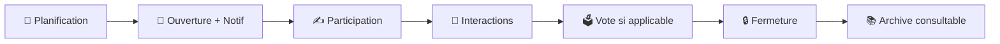

# 🎲 Règles de jeu & Boucle quotidienne

## ⏰ Cycle quotidien

## 📋 Règles fondamentales

1. **Planification automatique** : Création automatique pour chaque jour français (invariant J à J-1)
2. **Ouverture** : Notification automatique à tous les membres (si autorisée)
3. **Participation** : Soumissions visibles après avoir soumis sa propre réponse
4. **Interactions** : Commentaires et votes visibles après avoir soumis
5. **Vote** : Si type="vote", 1 vote par personne maximum (auto‑vote autorisé)
6. **Fermeture** : Archivage automatique → consultation en lecture seule

## ✨ Fonctionnalités clés (Périmètre v1)

### 👥 Gestion des groupes

- **Rôles** : `owner` unique / `admin` / `member`
- **Invitations** : Code permanent modifiable, généré automatiquement
- **Nom et image modifiables** : Nom et avatar personnalisables par owner/admin
  - Formats supportés : JPEG, PNG, WebP
  - Taille maximale : 2MB
  - Redimensionnement automatique vers plusieurs tailles
  - Suppression en cascade lors de la suppression du groupe
- **Authentification** : Google OAuth uniquement
- **Configuration** : Email du créateur défini via `APP_CREATOR_EMAIL` dans `.env`

### 🎯 Système de prompts hybride

- **Banque globale curatée** : Catalogue géré par le créateur (qualité/édition)
- **Prompts locaux** : Owners/admins créent des prompts spécifiques à leur groupe
- **Suggestions** :
  - Membres → banque **locale** (modération owner/admin)
  - Prompts locaux → banque **globale** (modération app creator)
- **Types** : `question`, `vote`, `challenge`
- **Sélection quotidienne (v1)** : **Uniquement** parmi les prompts **locaux** actifs (`group_prompts.is_active=true`). La banque globale ne nourrit pas directement la sélection v1 ; elle sert de réservoir éditorial et de provenance de certains prompts locaux.

#### Classification (taxonomie à facettes)

- Utiliser une taxonomie à facettes pour classer les prompts et guider la sélection/filtre.
- Facettes recommandées: Audience.
- Le champ `type` (`question`, `vote`, `challenge`) reste la source de vérité pour la modalité.
- “couple” et “friends” sont des valeurs de la facette Audience (pas un type de groupe).
- Ne pas inclure de facette “Seasonality / Event”.

> _Note : Un mode mixte (local + global approved) pourra être activé ultérieurement. Les garde‑fous et champs nécessaires sont déjà prévus._

### 💬 Interactions sociales

- **Soumissions** : Texte + médias, 1 par user/manche, définitives
- **Commentaires** : Discussion globale par manche (éditables/supprimables jusqu'à la fermeture)
- **Réactions** : Réactions typées sur soumissions et commentaires (1 par type/user/entité)
- **Votes** : 1 vote par manche (type "vote"), définitif, auto‑vote autorisé
- **Visibilité conditionnelle** : Tout (soumissions, commentaires, votes) devient visible après sa propre soumission

### 🔔 Notifications intelligentes

- **Ouverture** : Nouveau prompt disponible (`round_open`)
- **Préférences** : Par utilisateur **et** par groupe

### 📚 Consultation des manches

- **Archives** : Toutes les manches fermées restent consultables
- **Lecture seule** : Aucune interaction possible sur les manches fermées
