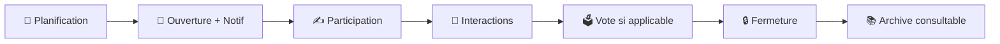

# 🎲 Règles de jeu & Boucle quotidienne

## ⏰ Cycle quotidien

## 📋 Règles fondamentales

1. **Planification automatique** : Création automatique pour chaque jour français (invariant J à J-1)
2. **Ouverture** : Notification automatique à tous les membres (si autorisée)
3. **Participation** : Soumissions visibles après avoir soumis sa propre réponse
4. **Interactions** : Commentaires et votes visibles après avoir soumis
5. **Vote** : Si type="vote", 1 vote par personne maximum (auto‑vote autorisé)
6. **Fermeture** : Archivage automatique → consultation en lecture seule

## ✨ Fonctionnalités clés (Périmètre v1)

### 👥 Gestion des groupes

- **Rôles** : `owner` unique / `admin` / `member`
- **Invitations** : Code permanent modifiable, généré automatiquement
- **Nom et image modifiables** : Nom et avatar personnalisables par owner/admin
  - Formats supportés : JPEG, PNG, WebP
  - Taille maximale : 2MB
  - Redimensionnement automatique vers plusieurs tailles
  - Suppression en cascade lors de la suppression du groupe
- **Suppression du groupe** : Cascade sur les entités liées; côté prompts, seuls les prompts locaux du groupe sont supprimés (`scope='group'`, `owner_group_id=G`), les prompts globaux sont conservés (`scope='global'`).
- **Authentification** : Google OAuth uniquement
- **Configuration** : Email du créateur défini via `APP_CREATOR_EMAIL` dans `.env`

### 🎯 Système de prompts hybride

- **Banque globale curatée** : Catalogue géré par le créateur (qualité/édition)
- **Prompts locaux** : Owners/admins créent des prompts spécifiques à leur groupe
- **Suggestions (unifiées)** :
  - Les suggestions sont des "prompts" créés avec `status='pending'`.
  - Locale: `scope='group'` avec `owner_group_id=G` (modération owner/admin).
  - Globale: `scope='global'` (modération app creator).
- **Types** : `question`, `vote`, `challenge`
  - **Sélection quotidienne** :
    - Par défaut: candidats = prompts locaux approuvés ET activés (`scope='group'`, `owner_group_id=G`, `status='approved'` ET `is_enabled=true`).
    - Si le groupe a activé "Autoriser la banque globale": étendre les candidats aux prompts globaux approuvés (`scope='global'`), selon `global_catalog_mode`/policies.
    - Une fois le prompt choisi, écrire un **snapshot immuable inline** dans `daily_rounds` (champs `source_prompt_id`, `resolved_*`).
    - Règles communes: anti‑répétition (fenêtre N=7), respect `min_group_size`/`max_group_size`, préférence d’audience si définie.

Filtrage audience (optionnel v1.1)

- Si `group_settings.group_audience_tag_id` est défini: sélectionner en priorité (ou filtrer) parmi les prompts locaux approuvés et activés taggés avec cette audience.
- Fallback si aucun prompt ne matche: revenir à tous les prompts locaux approuvés et activés (pour garantir l'ouverture quotidienne).

#### Classification (taxonomie à facettes)

- Utiliser une taxonomie à facettes pour classer les prompts et guider la sélection/filtre.
- Facettes recommandées: Audience.
- Le champ `type` (`question`, `vote`, `challenge`) reste la source de vérité pour la modalité.
- “couple” et “friends” sont des valeurs de la facette Audience (pas un type de groupe).
- Ne pas inclure de facette “Seasonality / Event”.

> _Note : Le mode mixte (local + global approuvés) est configurable par groupe et s’appuie sur un snapshot inline dans `daily_rounds` pour rester compatible avec la RLS et les archives, sans dupliquer le catalogue._

### 💬 Interactions sociales

- **Soumissions** : Texte + médias, 1 par user/manche, définitives
- **Commentaires** : Discussion globale par manche (éditables/supprimables jusqu'à la fermeture)
- **Votes** : 1 vote par manche (type "vote"), définitif, auto‑vote autorisé
- **Visibilité conditionnelle** : Tout (soumissions, commentaires, votes) devient visible après sa propre soumission

### 🔔 Notifications intelligentes

- **Ouverture** : Nouveau prompt disponible (`round_open`)
- **Préférences** : Par utilisateur **et** par groupe

### 📚 Consultation des manches

- **Archives** : Toutes les manches fermées restent consultables
- **Lecture seule** : Aucune interaction possible sur les manches fermées
