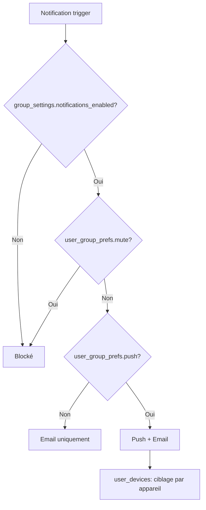

# 🔔 Notifications & Préférences

## 📨 Types de notifications

| Type           | Trigger             | Timing      |
| -------------- | ------------------- | ----------- |
| **round_open** | Ouverture de manche | À `open_at` |

## ⚙️ Système de préférences

## 📱 Architecture des notifications

### Tables impliquées

- **`notifications`** : File d'envoi des notifications
- **`user_devices`** : Appareils enregistrés pour push notifications
- **`user_group_prefs`** : Préférences par utilisateur et par groupe
- **`group_settings`** : Paramètres globaux du groupe

### Flux de traitement

1. **Trigger** : Un événement déclenche une notification (ex: ouverture de manche)
2. **Filtrage groupe** : Vérifier `group_settings.notifications_enabled`
3. **Filtrage utilisateur** : Vérifier `user_group_prefs.mute` pour chaque membre
4. **Sélection canal** : Push + Email ou Email seul selon `user_group_prefs.push`
5. **Envoi** : Traitement asynchrone via `notifications` table avec statut

### Gestion des appareils

- **Token unique** : Un token ne peut appartenir qu'à un seul utilisateur
- **Multi-plateforme** : Support iOS, Android et Web
- **Nettoyage automatique** : Suppression des tokens invalides lors des échecs d'envoi
