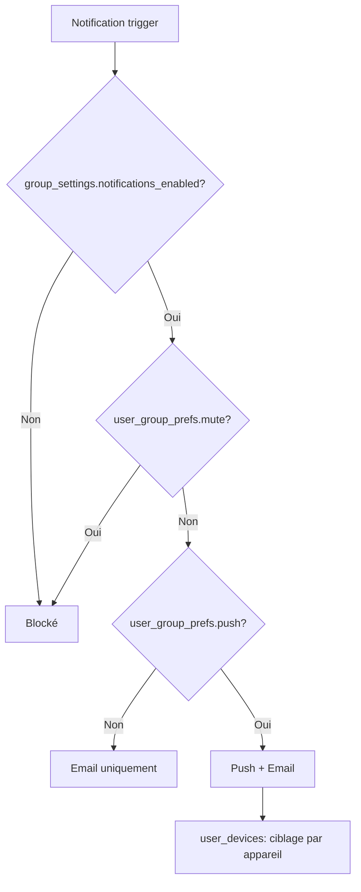

# 🔔 Notifications & Préférences

## 📨 Types de notifications

| Type                                  | Trigger                               | Timing                     |
| ------------------------------------- | ------------------------------------- | -------------------------- |
| **round_open**                        | Ouverture de manche                   | À `open_at`                |
| **transfer_requested**                | Demande de transfert de propriété     | À la création du transfert |
| **transfer_accepted**                 | Transfert accepté                     | À l'acceptation            |
| **transfer_rejected**                 | Transfert rejeté                      | Au refus                   |
| **group_prompt_suggestion_pending**   | Suggestion de prompt local en attente | À la soumission            |
| **group_prompt_suggestion_resolved**  | Suggestion locale approuvée/rejetée   | À la modération            |
| **global_prompt_suggestion_pending**  | Suggestion vers banque globale        | À la soumission            |
| **global_prompt_suggestion_resolved** | Suggestion globale traitée            | À la modération app        |

## ⚙️ Système de préférences

Sémantique:

- `mute=true` bloque toute notification (push et email) pour le couple (user, group)
- `push=false` désactive uniquement le canal push; l'email reste envoyé
- Exception par type: pour `round_open`, l'email n'est jamais utilisé; si `push=false`, aucune notification d'ouverture n'est envoyée

## 📱 Architecture des notifications

### Tables impliquées

- **`notifications`** : File d'envoi des notifications
- **`user_devices`** : Appareils enregistrés pour push notifications
- **`user_group_prefs`** : Préférences par utilisateur et par groupe
- **`group_settings`** : Paramètres globaux du groupe

### Flux de traitement

1. **Trigger** : Un événement déclenche une notification (ex: ouverture de manche)
2. **Ciblage membres actifs** : Joindre `group_members` et cibler uniquement `status='active'`
3. **Filtrage groupe** : Vérifier `group_settings.notifications_enabled`
4. **Filtrage utilisateur** : Vérifier `user_group_prefs.mute` pour chaque membre
5. **Sélection canal** : dépend du type; pour `round_open` → Push uniquement; pour les autres types → Push + Email ou Email seul selon `user_group_prefs.push`
6. **Envoi** : Traitement asynchrone via `notifications` table avec statut

### Gestion des appareils

- **Token unique** : Un token ne peut appartenir qu'à un seul utilisateur
- **Multi-plateforme** : Support iOS, Android et Web
- **Nettoyage automatique** : Suppression des tokens invalides lors des échecs d'envoi
