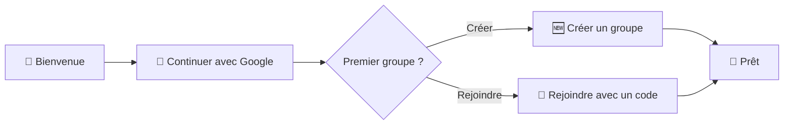

# 🎨 Parcours UX PWA 2025

## 🧭 Information Architecture

- Accueil: Feed multi‑groupes par jour, filtre par groupe, carte “Aujourd’hui” en tête
- Groupes: Détail groupe (image, membres, code), Réglages (drop_time, notifications)
- Manche (Round): Vue “Aujourd’hui” (scheduled/open) et “Archives” (closed)
- Création/Jointure: Créer un groupe, rejoindre via code
- Préférences: Préférences par groupe (mute/push)
- Admin: Modération (soft delete), rôles, nom/image

## 🎯 Objectifs & Principes

- Push‑only, pas d’email ni de rappel
- Visibilité conditionnelle (RLS): contenu visible après participation (soumission OU vote)
- 1 manche/jour/groupe, heure française fixe; fallback si aucun prompt actif
- PWA first: installable, performante, résiliente hors‑ligne

## 🚀 Onboarding & Auth (Google)



## 🏠 Feed multi‑groupes

```text
Aujourd'hui (Open)   |  Groupe Alpha   | ⏰ Ferme à 20:00
Hier (Closed)        |  Groupe Bravo   | 📚 Archive
Avant‑hier (Closed)  |  Groupe Alpha   | 📚 Archive

[ Filtrer par groupe ▾ ]
```

- Clic sur un groupe dans la liste/Feed → ouvre directement la manche du jour de ce groupe (si `open`), sinon la manche programmée (scheduled) associée à aujourd’hui.

## 🎯 Round — états clés

### Scheduled (J‑1)
- Message: “Ouverture prévue à HH:MM (heure France)”
- Cas fallback: “En attente d’un prompt actif — pas d’ouverture tant qu’aucun prompt n’est activé”

### Open — avant participation
```
┌────────────────────────────────────────┐
│ 🎯 PROMPT                              │
│ "Quel est votre super‑pouvoir rêvé ?" │
│ [ ✍️ Répondre ]       ⏰ Ferme à 20:00  │
├────────────────────────────────────────┤
│ 🔒 Contenu masqué                      │
│ Participez pour voir les contributions │
└────────────────────────────────────────┘
```

### Open — après participation
```
┌────────────────────────────────────────┐
│ 🎯 PROMPT + ✅ Votre réponse            │
├────────────────────────────────────────┤
│ 📝 SOUMISSIONS (temps réel)            │
│  • Alice …                             │
│  • Bob …                               │
├────────────────────────────────────────┤
│ 💬 DISCUSSION GLOBALE                  │
│ [ Ajouter un commentaire ]             │
├────────────────────────────────────────┤
│ 🗳️ VOTE (si type=vote)                 │
│  • Mon vote (définitif)                │
└────────────────────────────────────────┘
```

### Closed — archives
```
┌────────────────────────────────────────┐
│ 📚 MANCHE FERMÉE — Lecture seule       │
│  • Soumissions                         │
│  • Commentaires                        │
│  • (Vote si applicable)                │
└────────────────────────────────────────┘
```

## 📝 Soumission & Médias
- Éditeur simple: texte + “Ajouter média”
- Validations: image ≤ 5MB (jpeg/png/webp), vidéo ≤ 25MB (mp4 H.264/AAC), audio ≤ 10MB (mp3/m4a)
- Upload: barre de progression, reprise sur erreur (idempotent)
- Résilience: tentative de Background Sync si dispo; sinon retry manuel guidé

## 💬 Commentaires
- Discussion globale par manche
- Avant participation: fil masqué
- Après participation: composer actif, affichage chronologique
- Closed: lecture seule

## 🗳️ Votes
- 1 vote/user/round, définitif, auto‑vote autorisé
- Voter débloque la visibilité (comme une soumission)

## 🔔 Notifications & Préférences (push‑only)
- Par groupe: `mute` (bloque tout push) et `push` (on/off)
- Permissions push: approche progressive (proposer après 1–2 participations, pas au 1er écran)
- Pas d’email, pas de rappel

## 👥 Détail Groupe & Réglages
- Détail: image, nom, code d’invitation (copier), membres (rôle)
- Réglages owner/admin:
  - drop_time (heure France)
  - notifications du groupe (on/off)
  - Audience du groupe (préférence optionnelle)
  - Source de sélection des prompts: **Locaux uniquement** ou **Locaux + Catalogue global** (snapshot à l'ouverture)
  - modifier nom/image (suppression Storage en arrière‑plan)
  - rôles (promouvoir/dépromouvoir)
  - supprimer groupe (confirmation + conséquences)

Note: l’entrée de groupe par défaut redirige vers la manche du jour; l’aperçu du groupe reste accessible via un onglet/route "overview" dédié.

## 🛡️ Modération (owner/admin)
- Soft delete sur soumissions/commentaires (masquage pour tous)
- Traçabilité: `deleted_by_admin`, `deleted_at`

## 📲 PWA — Essentiels

- App Shell léger + Server Components; budget JS initial < 100KB
- Manifest complet (`display=standalone`, icônes, thème); shortcuts “Aujourd’hui”, “Mon groupe”
- Offline‑first utile: cache des 3 derniers jours du feed + pages de rounds fermés; fallback hors‑ligne élégant
- Web Share Target: partager une image/du texte dans “Ajouter à ma réponse (aujourd’hui)”
- Service Worker:
  - Precaching App Shell et assets
  - Runtime caching (stale‑while‑revalidate) pour images Storage signées
  - Push handler (type `round_open`) → badging + deep‑link `/today` ou `/rounds/[id]`
  - Background Sync pour uploads quand dispo

## 🔗 Deep Links & Shortcuts

- `jimboa.fr/join/[CODE]` pour rejoindre directement un groupe
- Shortcut “Aujourd’hui” → `/today`, “Mon groupe (du jour)” → `/app/groups/[id]/current`

## 🧩 Navigation
- Mobile: Feed / Groupes / Nouveau / Profil
- Badge push sur Feed si `round_open`

## 🎯 Principes UX

### Visibilité conditionnelle
- Mystère initial: contenu masqué jusqu’à participation
- Révélation: tout visible après participation (soumission OU vote)

### Engagement quotidien
- Rituel simple: 1 action/jour
- Temps limité: fermeture automatique (heure France)
- Feedback immédiat: soumissions et commentaires en temps réel

### Architecture de l’information
- Hiérarchie: Prompt → Soumissions → Discussion → Votes
- État: statut de la manche toujours visible
- Navigation: accès rapide aux archives et au filtre groupe

## 🧱 Arborescence Routes (Next.js App Router)

```text
app/
  layout.tsx                      # layout racine (thème, fonts, toasts, Providers)
  globals.css

  favicon.ico
  manifest.webmanifest            # PWA minimal (icônes via /public)
  robots.txt                      # SEO (App Router)                    ← cf. docs
  sitemap.ts                      # SEO (sitemap dynamique)            ← cf. docs
  opengraph-image.tsx             # OG global par défaut

  (marketing)/                    # Regroupe les pages publiques
    layout.tsx
    page.tsx                      # Landing "Jimboa"
    privacy/page.tsx
    terms/page.tsx

  (auth)/                         # Flux d’auth Google (Supabase SSR)
    layout.tsx
    login/page.tsx                # Bouton "Continuer avec Google"
    callback/route.ts             # Handler retour OAuth si nécessaire (proxy)
    logout/route.ts               # Invalidation cookie + redirect
    error/page.tsx

  (app)/                          # Espace authentifié (require auth)
    layout.tsx                    # Navbar, guard auth (Server Component)
    loading.tsx
    error.tsx

    page.tsx                      # /app → redirige vers /app/feed
    feed/
      page.tsx                    # Agrégat multi-groupes (Aujourd'hui, J-1, J-2…)
      loading.tsx
    activity/
      page.tsx                    # "Mon activité" (soumissions, commentaires, votes)

    groups/
      page.tsx                    # Liste de mes groupes + CTA créer/rejoindre
      new/
        page.tsx                  # Création d’un groupe
        actions.ts                # SA: createGroup (normalise join_code UPPER)
      join/
        page.tsx                  # Rejoindre via code
        actions.ts                # SA: joinWithCode

      [groupId]/
        layout.tsx                # Header groupe (image, tabs)
        page.tsx                  # Redirect → rounds/current (manche du jour)
        overview/
          page.tsx                # Vue d’ensemble groupe (dernier round, membres)

        settings/
          page.tsx                # Réglages (drop_time, notifications_enabled)
          actions.ts              # SA: updateGroupSettings
        members/
          page.tsx                # Liste + rôles (owner/admin/member)
          actions.ts              # SA: promote/demote/leave
        invite/
          page.tsx                # Code d’invitation (regenerate/disable)
          actions.ts              # SA: regenerateJoinCode / toggleJoin
        prompts/                  # Banque locale (owner/admin)
          page.tsx
          new/
            page.tsx
            actions.ts            # SA: createLocalPrompt
          [promptId]/
            page.tsx              # Détails
            edit/
              page.tsx
              actions.ts          # SA: updateLocalPrompt / toggleActive
          suggestions/            # Modération des suggestions locales (pending)
            page.tsx
            actions.ts            # SA: approve/reject (crée group_prompt)

        rounds/
          page.tsx                # Historique des manches (fermées/ ouvertes)
          current/
            page.tsx              # Résolution manche du jour (open ou scheduled) → redirect /rounds/[roundId]
          [roundId]/
            page.tsx              # Écran de manche
            opengraph-image.tsx   # OG pour partage du round
            submit/
              page.tsx            # Formulaire de soumission (texte + média)
              actions.ts          # SA: createSubmission (1/user/round)
            vote/                 # Pour les prompts type "vote"
              page.tsx
              actions.ts          # SA: castVote (définitif)
            comments/
              page.tsx            # Discussion globale (visible après participation)
              actions.ts          # SA: addComment / editBeforeClose / deleteBeforeClose

    admin/                        # Interface "app creator" (gated par email RLS)
      layout.tsx
      page.tsx                    # Dashboard admin global
      prompts/
        page.tsx                  # Banque globale (pending/approved/rejected/archived)
        [promptId]/
          page.tsx
          edit/
            page.tsx
            actions.ts            # SA: approve/reject/archive/edit global prompt
      suggestions/
        page.tsx                  # Suggestions locales → global (pending)
        actions.ts                # SA: resolveGlobalSuggestion

  (api)/                          # Regroupe les handlers techniques (non indexés)
    api/
      cron/
        create-rounds/route.ts    # J-1 : UPSERT rounds (idempotent)
        open-rounds/route.ts      # J : scheduled→open (+ notifications)
        close-rounds/route.ts     # J+1 : open→closed
      notifications/
        send-push/route.ts        # Worker d’envoi batch (webhook interne)
      webhooks/
        supabase/route.ts         # (optionnel) évts DB → traitement applicatif

  (status)/
    health/route.ts               # 200 OK (liveness)
    ready/route.ts                # checks DB, Supabase, push provider (readiness)

  not-found.tsx                   # 404 globale
  global-error.tsx                # Erreurs non interceptées
```

## 🎛️ Micro‑interactions & Perf

- Skeletons pour feed/round; placeholders médias; toasts (soumis, voté, commenté)
- Prefetch ciblé (hover/touch); lazy images; CSS critical path
- Minutage: timers synchronisés sur UTC, affichage heure France

## ♿ Accessibilité

- Contrastes AA, focus visibles, labels explicites
- Préférence “reduce motion”; lecteurs médias natifs accessibles

## 📈 Observabilité & Analytics

- Web Vitals (TTFB, LCP, INP), erreurs JS, taux d’échec upload
- Produit: taux de participation/jour, opt‑in push, rétention multi‑jours
