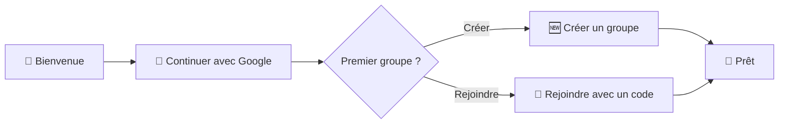

# 🎨 Parcours UX V1

## 🧭 Information Architecture

- Accueil: Feed multi‑groupes par jour, filtre par groupe, carte “Aujourd’hui” en tête
- Groupes: Détail groupe (image, membres, code), Réglages (drop_time, notifications)
- Manche (Round): Vue “Aujourd’hui” (scheduled/open) et “Archives” (closed)
- Création/Jointure: Créer un groupe, rejoindre via code
- Préférences: Préférences par groupe (mute/push)
- Admin: Modération (soft delete), rôles, nom/image

## 🚀 Onboarding & Auth (Google)



## 🏠 Feed multi‑groupes

```text
Aujourd'hui (Open)   |  Groupe Alpha   | ⏰ Ferme à 20:00
Hier (Closed)        |  Groupe Bravo   | 📚 Archive
Avant‑hier (Closed)  |  Groupe Alpha   | 📚 Archive

[ Filtrer par groupe ▾ ]
```

## 🎯 Round — états clés

### Scheduled (J‑1)
- Message: “Ouverture prévue à HH:MM (heure France)”
- Cas fallback: “En attente d’un prompt actif — pas d’ouverture tant qu’aucun prompt n’est activé”

### Open — avant participation
```
┌────────────────────────────────────────┐
│ 🎯 PROMPT                              │
│ "Quel est votre super‑pouvoir rêvé ?" │
│ [ ✍️ Répondre ]       ⏰ Ferme à 20:00  │
├────────────────────────────────────────┤
│ 🔒 Contenu masqué                      │
│ Participez pour voir les contributions │
└────────────────────────────────────────┘
```

### Open — après participation
```
┌────────────────────────────────────────┐
│ 🎯 PROMPT + ✅ Votre réponse            │
├────────────────────────────────────────┤
│ 📝 SOUMISSIONS (temps réel)            │
│  • Alice …                             │
│  • Bob …                               │
├────────────────────────────────────────┤
│ 💬 DISCUSSION GLOBALE                  │
│ [ Ajouter un commentaire ]             │
├────────────────────────────────────────┤
│ 🗳️ VOTE (si type=vote)                 │
│  • Mon vote (définitif)                │
└────────────────────────────────────────┘
```

### Closed — archives
```
┌────────────────────────────────────────┐
│ 📚 MANCHE FERMÉE — Lecture seule       │
│  • Soumissions                         │
│  • Commentaires                        │
│  • (Vote si applicable)                │
└────────────────────────────────────────┘
```

## 📝 Soumission & Médias
- Éditeur simple: texte + “Ajouter média”
- Validations: image ≤ 5MB (jpeg/png/webp), vidéo ≤ 25MB (mp4 H.264/AAC), audio ≤ 10MB (mp3/m4a)
- Upload: barre de progression, reprise sur erreur (idempotent)

## 💬 Commentaires
- Discussion globale par manche
- Avant participation: fil masqué
- Après participation: composer actif, affichage chronologique
- Closed: lecture seule

## 🗳️ Votes
- 1 vote/user/round, définitif, auto‑vote autorisé
- Voter débloque la visibilité (comme une soumission)

## 🔔 Notifications & Préférences (push‑only)
- Par groupe: `mute` (bloque tout push) et `push` (on/off)
- Permission push: bannière d’activation si désactivée
- Pas d’email, pas de rappel

## 👥 Détail Groupe & Réglages
- Détail: image, nom, code d’invitation (copier), membres (rôle)
- Réglages owner/admin:
  - drop_time (heure France)
  - notifications du groupe (on/off)
  - modifier nom/image (suppression Storage en arrière‑plan)
  - rôles (promouvoir/dépromouvoir)
  - supprimer groupe (confirmation + conséquences)

## 🛡️ Modération (owner/admin)
- Soft delete sur soumissions/commentaires (masquage pour tous)
- Traçabilité: `deleted_by_admin`, `deleted_at`

## 🧩 Navigation
- Mobile: Feed / Groupes / Nouveau / Profil
- Badge push sur Feed si `round_open`

## 🎯 Principes UX

### Visibilité conditionnelle
- Mystère initial: contenu masqué jusqu’à participation
- Révélation: tout visible après participation (soumission OU vote)

### Engagement quotidien
- Rituel simple: 1 action/jour
- Temps limité: fermeture automatique (heure France)
- Feedback immédiat: soumissions et commentaires en temps réel

### Architecture de l’information
- Hiérarchie: Prompt → Soumissions → Discussion → Votes
- État: statut de la manche toujours visible
- Navigation: accès rapide aux archives et au filtre groupe
