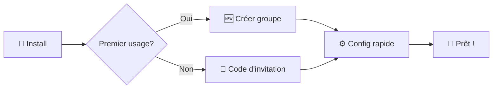

# 🎨 Parcours UX prioritaires

## 🚀 Onboarding (< 2 min)



## 🏠 Écran principal "Aujourd'hui"

### **Avant de soumettre sa réponse :**

```
┌────────────────────────────────────────┐
│  🎯 PROMPT DU JOUR                     │
│  "Quel est votre super‑pouvoir rêvé?" │
│                                        │
│  [ ✍️ Répondre ]     ⏰ Ferme à 20h00   │
├────────────────────────────────────────┤
│  🔒 Contenu masqué                     │
│                                        │
│  Soumettez votre réponse pour voir :   │
│  • Les réponses des autres membres     │
│  • La discussion du groupe             │
│  • Les votes (si applicable)           │
│                                        │
│  👥 3 membres ont déjà participé       │
└────────────────────────────────────────┘
```

### **Après avoir soumis sa réponse :**

```
┌────────────────────────────────────────┐
│  🎯 PROMPT DU JOUR                     │
│  "Quel est votre super‑pouvoir rêvé?" │
│                                        │
│  ✅ Votre réponse: "Téléportation!"     │
├────────────────────────────────────────┤
│  📝 SOUMISSIONS (temps réel)           │
│                                        │
│  👤 Alice: "Lire dans les pensées!"    │
│  👤 Bob: "Voler comme Superman"        │
│  👤 Vous: "Téléportation!"             │
├────────────────────────────────────────┤
│  🗳️ VOTES (si applicable)              │
│  👤 Alice: 2 votes                      │
│  👤 Bob: 1 vote                         │
├────────────────────────────────────────┤
│  💬 DISCUSSION GLOBALE                 │
│                                        │
│  👤 Alice: "Excellent choix Bob!"      │
│  👤 Charlie: "Moi j'hésite encore..."  │
│  [ 💬 Ajouter un commentaire ]         │
└────────────────────────────────────────┘
```

## 📚 Round archivé (Consultation)

```
┌────────────────────────────────────────┐
│  📚 MANCHE D'HIER - Fermée             │
│                                        │
│  👤 Bob: "Voler comme Superman"        │
│  💬 3 commentaires                      │
│                                        │
│  👤 Alice: "Lire dans les pensées!"    │
│  💬 2 commentaires                      │
│                                        │
│  👤 Charlie: "Téléportation!"          │
│  💬 1 commentaire                       │
│                                        │
│  📊 3 participants, 6 commentaires      │
│  📸 2 médias partagés                   │
│  🔒 Fermée - Lecture seule              │
└────────────────────────────────────────┘
```

## 🎯 Principes UX

### Visibilité conditionnelle

- **Mystère initial** : Le contenu est masqué jusqu'à la participation
- **Révélation progressive** : Dévoilement après soumission de sa propre réponse
- **Incitation claire** : Indication du nombre de participants pour créer l'envie

### Engagement quotidien

- **Ritual simple** : Une action par jour, pas plus
- **Temps limité** : Fermeture automatique pour créer l'urgence
- **Feedback immédiat** : Réactions et commentaires en temps réel

### Architecture de l'information

- **Hiérarchie claire** : Prompt → Soumissions → Discussion → Votes
- **État visible** : Statut de la manche toujours affiché
- **Navigation intuitive** : Accès facile aux archives
