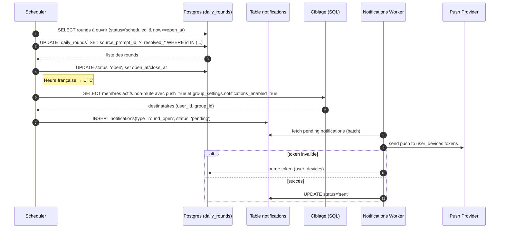
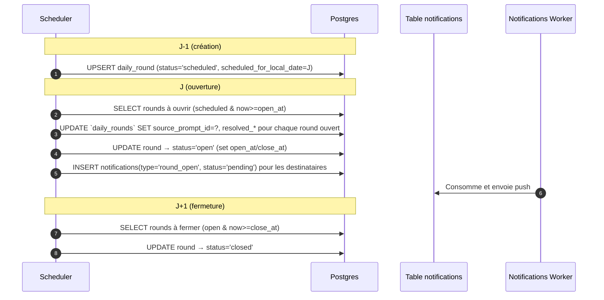

# ⚙️ Workflow d'orchestration (Jobs)

## 🔄 Principes

- **Idempotence stricte** : transitions contrôlées par `status` + clés uniques
- **Horodatage** : `open_at` et `close_at` calculés en UTC selon l'heure française et `drop_time`
- **Durée fixe** : `close_at = ZonedDateTime(date_française+1, drop_time, "Europe/Paris")`
- **Locks** : advisory lock par `group_id` pour éviter les doubles transitions

## 📅 Création planifiée (toutes les 5-10 min)

**Objectif** : Créer automatiquement une nouvelle manche `scheduled` pour les groupes éligibles.

### Conditions de déclenchement

- Il n'existe pas encore de `daily_round` pour `(group_id, scheduled_for_local_date=J)` où J est le jour français suivant
- Le groupe est actif (`is_active = true`)

### Logique de sélection des prompts

- **Source par défaut** : Prompts locaux approuvés ET activés (`scope='group'`, `owner_group_id=G`, `status='approved'` ET `is_enabled=true`)
- **Banque globale (option groupe)** : si `group_settings.allow_global_prompts=true`, inclure des `prompts` `scope='global'` approuvés comme candidats, sans clonage; créer ensuite le snapshot inline dans `daily_rounds` à l'ouverture (resolved_*)
- **Anti-répétition** : Exclusion des 7 derniers prompts utilisés par le groupe
- **Blocklist** : Exclure les prompts présents dans `group_prompt_blocks` pour le groupe
- **Filtres** : Respecter `min_group_size`/`max_group_size` et la préférence d’audience si définie
- **Sélection** : Choix aléatoire parmi les prompts éligibles
- **Planification** : Pour le jour J (français) avec `scheduled_for_local_date=J`

## 🔓 Ouverture (toutes les 5 min)

**Objectif** : Faire passer les manches de `scheduled` → `open` à l'heure française configurée.

### Conditions d'ouverture

- Statut de la manche : `scheduled`
- Date atteinte : Date française courante ≥ `scheduled_for_local_date`
- Heure atteinte : Heure française courante ≥ `drop_time` du groupe (Europe/Paris)

### Actions effectuées

- Transition vers le statut `open`
- Définition de `open_at` = ZonedDateTime(scheduled_for_local_date, drop_time, "Europe/Paris") → UTC
- Calcul de `close_at` = ZonedDateTime(scheduled_for_local_date+1, drop_time, "Europe/Paris") → UTC
- Déclenchement des notifications aux membres (si activées et non‑mute)

### Séquence — Ouverture `round_open`

## 🔒 Fermeture (toutes les 5 min)

**Objectif** : Fermer automatiquement les manches arrivées à échéance.

### Conditions de fermeture

- Statut de la manche : `open`
- Échéance atteinte : Timestamp courant ≥ `close_at`

### Actions effectuées

- Transition vers le statut `closed`
- Archivage automatique : la manche devient consultable en lecture seule
- Fin des interactions : plus de soumissions, commentaires ou votes possibles

## 🔁 Séquence — Cycle quotidien (J‑1 → open → close)

## 🔒 Garanties d'intégrité

### Contrôles de cohérence

- **Transitions** : Séquence stricte `scheduled → open → closed` uniquement
- **Unicité** : Une seule manche par jour et par groupe (`group_id`, `scheduled_for_local_date`)
- **Verrous** : Advisory locks pour éviter les doubles exécutions sur le même groupe
- **Idempotence** : Les jobs peuvent être relancés sans effet de bord

### Gestion des erreurs

- **Retry automatique** : Nouvelle tentative en cas d'échec ponctuel
- **Isolation** : L'échec sur un groupe n'impacte pas les autres
- **Logs détaillés** : Traçabilité complète des opérations et erreurs

## 📊 Monitoring des jobs

### Métriques à surveiller

- **Temps d'exécution** : Durée de chaque job
- **Échecs** : Nombre d'erreurs par type de job
- **Latence** : Délai entre l'heure prévue et l'exécution effective
- **Throughput** : Nombre de groupes traités par minute

### Alertes critiques

- **Job bloqué** : Aucune exécution depuis > 1h
- **Échec massif** : > 10% d'échecs sur une période
- **Dérive horaire** : Ouvertures avec > 5min de retard
